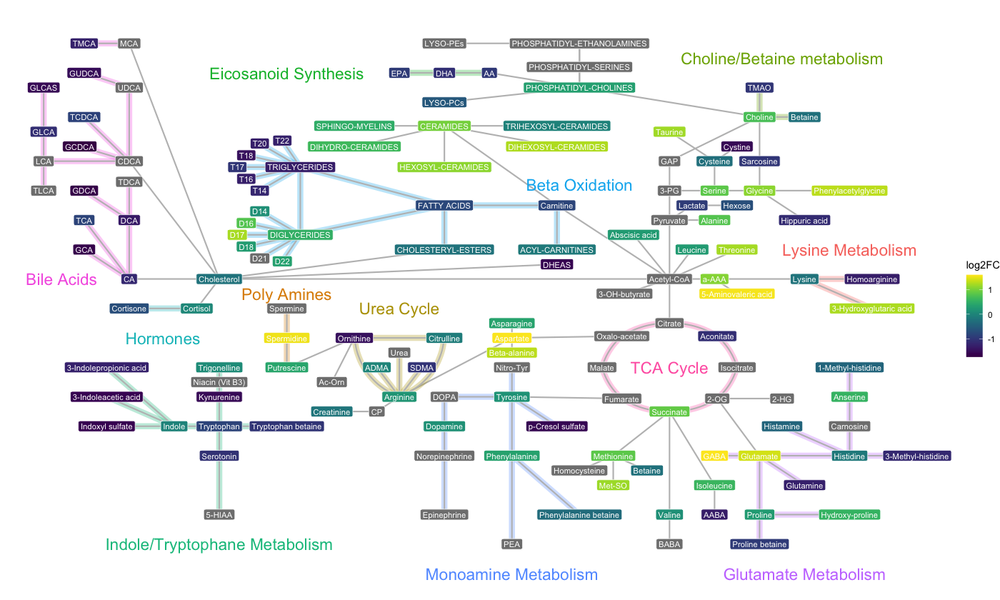

MetAlyzer
========

<!-- badges: start -->
[](https://github.com/Lu-Group-UKHD/MetAlyzer/actions/workflows/R-CMD-check.yaml)
[](https://www.gnu.org/licenses/gpl-3.0.en.html)
[](https://cran.r-project.org/package=MetAlyzer)
<!-- badges: end -->

**An R Package to read and analyze WebIDQ&trade; output**

The package provides methods to read output files from the WebIDQ&trade; software into R. Metabolomics data is read and reformatted into an S4 object for convenient data handling, statistics and downstream analysis.

## Install

There is a version available on CRAN.

```r
install.packages("MetAlyzer")
```

For the latest version install from GitHub
```r
library(devtools)
install_github("Lu-Group-UKHD/MetAlyzer")
```

## Quickstart

The package takes metabolomic measurements and the quantification status (e.g. "Valid", "LOQ", "LOD") as ".xlsx" files generated from the WebIDQ&trade; software. Additionally, meta data for each sample can be provided for further analysis.

This is an extract from one of the provided example data sets.


#### Create MetAlyzer object:
```r
> metalyzer_se <- MetAlyzer::read_webidq(file_path = load_demodata_biocrates())


 _____ ______   _______  _________  ________  ___           ___    ___ ________  _______   ________
|\   _ \  _   \|\  ___ \|\___   ___\\   __  \|\  \         |\  \  /  /|\_____  \|\  ___ \ |\   __  \
\ \  \\\__\ \  \ \   __/\|___ \  \_\ \  \|\  \ \  \        \ \  \/  / /\|___/  /\ \   __/|\ \  \|\  \
 \ \  \\|__| \  \ \  \_|/__  \ \  \ \ \   __  \ \  \        \ \    / /     /  / /\ \  \_|/_\ \   _  _\
  \ \  \    \ \  \ \  \_|\ \  \ \  \ \ \  \ \  \ \  \____    \/   / /     /  /_/__\ \  \_|\ \ \  \\  \| 
   \ \__\    \ \__\ \_______\  \ \__\ \ \__\ \__\ \_______\__/   / /     |\________\ \_______\ \__\\ _\ 
    \|__|     \|__|\|_______|   \|__|  \|__|\|__|\|_______|\____/ /       \|_______|\|_______|\|__|\|__|
                                                          \|____|/


Info: Reading color code "FFCBD2D7" as "#CBD2D7"
Info: Reading color code "FFB2D1DC" as "#B2D1DC"
Info: Reading color code "FF7FB2C5" as "#7FB2C5"
Info: Reading color code "FFB9DE83" as "#B9DE83"
Info: Reading color code "FFB9DE83" as "#B9DE83"
Info: Reading color code "FFFFF099" as "#FFF099"
Info: Reading color code "FFFFF099" as "#FFF099"
Info: Reading color code "FFA28BA3" as "#A28BA3"
Info: Reading color code "FFA28BA3" as "#A28BA3"
Info: Reading color code "FFB2D1DC" as "#B2D1DC"
Info: Reading color code "FF7FB2C5" as "#7FB2C5"

Measured concentration values:
------------------------------
          0%          25%          50%          75%         100% 
    0.000000     0.286299     1.289381     6.308854 12522.000000 

NAs: 762 (3.74%)


Measured quantification status:
-------------------------------
Valid: 15419 (75.66%)
LOQ: 983 (4.82%)
LOD: 3978 (19.52%)
NAs: 0 (0%)
```

### Visualizations:
The plotting functions plot_log2FC and plot_network can accept a standard data frame containing log2FC results, and a stat column.

```r
diffres_df <- readRDS(MetAlyzer::toy_diffres())
```

```r
network <- MetAlyzer::plot_network(
  diffres_df,
  q_value = 0.05,
  metabolite_col = "Metabolite",
  values_col_name = "log2FC",
  stat_col_name = "qval",
  metabolite_text_size = 2,
  connection_width = 0.75,
  pathway_text_size = 4,
  pathway_width = 4,
)

network$Plot
```



## Detailed instructions
**For a comprehensive tutorial, please check out the MetAlyzer Vignettes**.\
**Please also check out [MetAlyzer on CRAN](https://CRAN.R-project.org/package=MetAlyzer
).**
