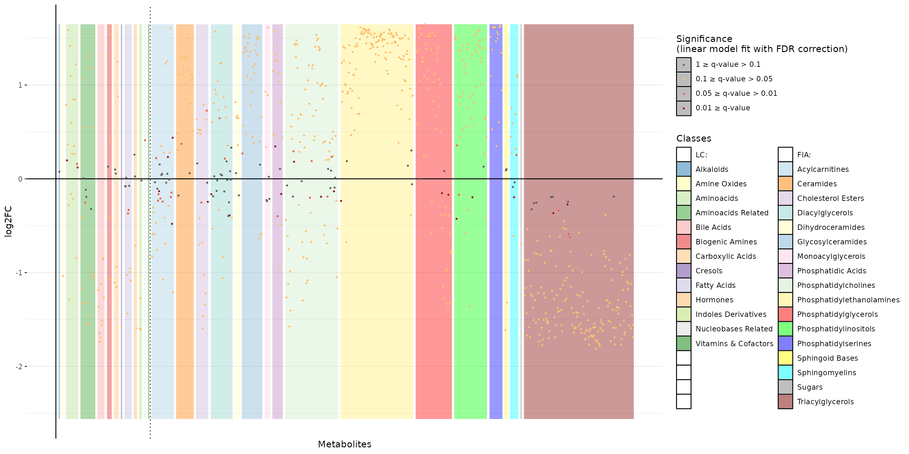
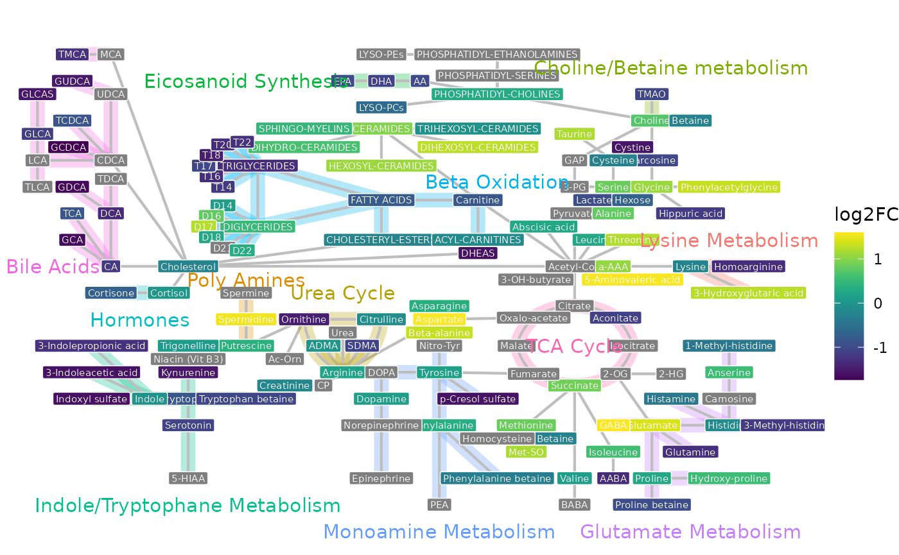
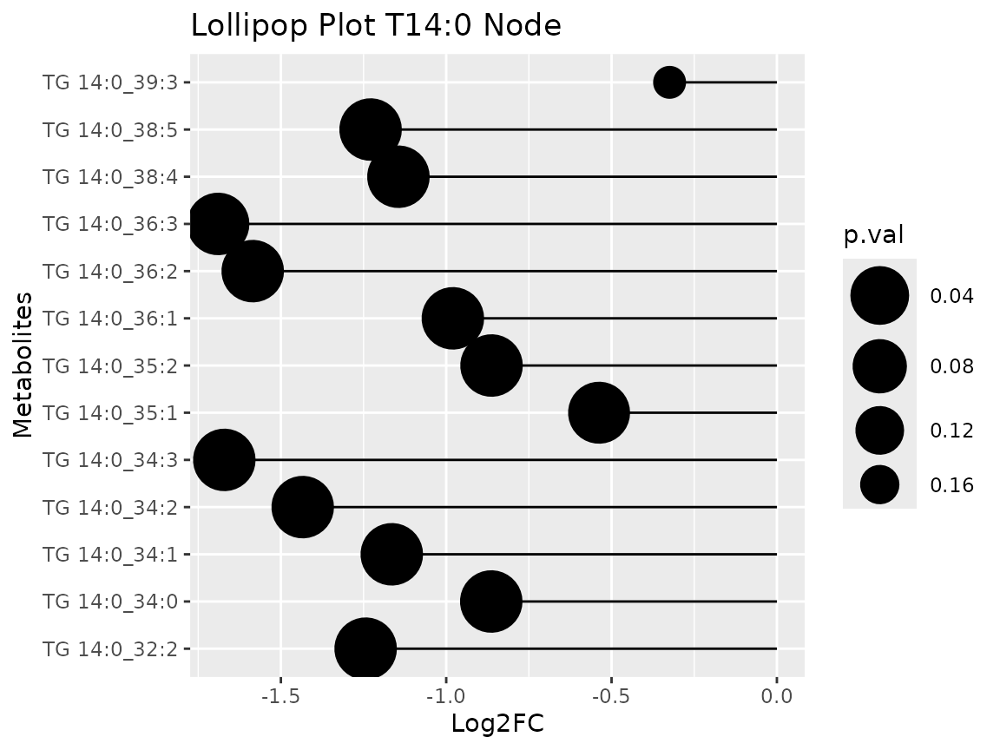

# R-package User Guide

The ***MetAlyzer*** R-package provides a robust toolkit for importing,
handling, and analyzing metabolomics data generated using either the
Biocrates Quant500L™ or Quant500XL™ kit and the Biocrates WebIDQ™
software (BIOCRATES Life Sciences AG, Innsbruck, Austria). It structures
the data into a SummarizedExperiment (SE) (Morgan et al. 2025) object,
facilitating integration with Bioconductor workflows and enabling
downstream statistical analysis and visualization. To aid in biological
interpretation, ***MetAlyzer*** offers functions to generate key
visualizations. These include scatter plots with information about the
metabolite classes as assigned by BIOCRATES Life Sciences AG and a
network plot, which readily visualizes the whole metabolite space of the
kit and colour codes the metabolites that are detected for e.g. Log2FC
differences between conditions of interest. These network visualizations
are crucial for understanding the complex interconnections between
metabolites, helping to find pathway-level alterations and providing a
systems perspective on the metabolic response under investigation.

## Loading and Exploring Data

### Import data from WebIDQ™

***MetAlyzer’s*** primary entry point is the
[`MetAlyzer::read_webidq()`](../reference/read_webidq.md) function,
which reads WebIDQ™ .xlsx output files (Fig. 1).  
As the output files contain layered information, inform of concentration
values and color-coded quantification status (e.g., “Valid”, “LOD”,
“LOQ”), it is a tedious task to reliably process this data
computationally, as the mix of numerical values and status codes hinders
direct machine readability by standard analysis tools. To conveniently
read the data in we provide the function
[`MetAlyzer::read_webidq()`](../reference/read_webidq.md), structuring
the data into a SummarizedExperiment (SE) object (Morgan et al. 2025)
for easy downstream analysis. For further demonstration we’ll use a demo
dataset kindly provided by BIOCRATES Life Sciences AG, featuring
metabolite measurements across two groups (MxP®Quant 500 kit). This
dataset is included in the ***MetAlyzer*** R package as the example
data.


Figure 1: Output of Biocrates WebIDQ™.

``` r
# Access the example data file path
fpath <- MetAlyzer::load_demodata_biocrates()

# Load the data into a SummarizedExperiment object
metalyzer_se <- MetAlyzer::read_webidq(fpath,
                                       silent = TRUE)

# Display the object summary
metalyzer_se
#> class: SummarizedExperiment 
#> dim: 1019 20 
#> metadata(4): file_path sheet_index status_list aggregated_data
#> assays(2): conc_values quant_status
#> rownames(1019): C0 C2 ... TG 22:6_34:3 Choline
#> rowData names(1): metabolic_classes
#> colnames(20): 14 15 ... 32 33
#> colData names(13): Plate bar code Sample bar code ... Injection number
#>   Measurement time
```

The resulting SummarizedExperiment object organizes the data:

**Assay**: Contains matrices for `MetAlyzer::conc_values` (metabolite
concentrations) and `MetAlyzer::quant_status` (quantification status).  
**rowData**: Stores metabolite information, including names and assigned
classes. Note the distinction between quantified metabolites and
calculated ‘Metabolism Indicators’.  
**colData**: Holds sample-specific metadata provided in the input file
or added later.  
**metadata**: Contains supplementary information like the original file
path, sheet index, status color mappings, and a pre-joined
aggregated_data tibble combining concentrations, status, and metadata
for easier analysis and plotting.

|               |        14 |        15 |        16 |        17 |        18 |        19 |        20 |        21 |       22 |        23 |        24 |        25 |        26 |        27 |        28 |        29 |        30 |        31 |        32 |        33 |
|:--------------|----------:|----------:|----------:|----------:|----------:|----------:|----------:|----------:|---------:|----------:|----------:|----------:|----------:|----------:|----------:|----------:|----------:|----------:|----------:|----------:|
| C0            | 16.400000 | 15.000000 | 14.900000 | 16.400000 | 16.200000 | 15.900000 | 15.300000 | 16.200000 | 15.20000 | 16.300000 | 37.500000 | 31.000000 | 24.300000 | 25.100000 | 38.800000 | 31.200000 | 32.400000 | 28.300000 | 31.700000 | 31.000000 |
| C2            |  2.180000 |  2.020000 |  1.930000 |  2.390000 |  2.430000 |  2.180000 |  2.080000 |  2.390000 |  2.30000 |  2.400000 |  4.170000 |  3.690000 |  3.250000 |  4.570000 |  4.220000 |  4.060000 |  3.820000 |  3.770000 |  3.580000 |  4.510000 |
| C3            |  2.300000 |  2.150000 |  2.180000 |  2.470000 |  2.500000 |  1.960000 |  1.950000 |  2.400000 |  2.02000 |  2.470000 |  1.110000 |  1.010000 |  0.980000 |  0.950000 |  1.320000 |  1.060000 |  1.100000 |  0.995000 |  0.996000 |  1.010000 |
| C3-DC (C4-OH) |  0.032707 |  0.036251 |  0.039705 |  0.047537 |  0.042832 |  0.041272 |  0.039284 |  0.041027 |  0.04055 |  0.041446 |  0.042609 |  0.039763 |  0.043894 |  0.047226 |  0.041546 |  0.047589 |  0.041796 |  0.047158 |  0.039900 |  0.067801 |
| C3-OH         |  0.151405 |  0.089557 |  0.099846 |  0.111255 |  0.091946 |  0.079343 |  0.000000 |  0.000000 |  0.00000 |  0.057869 |  0.000000 |  0.051607 |  0.304305 |  0.099947 |  0.125005 |  0.154705 |  0.274055 |  0.000000 |  0.243805 |  0.096540 |
| C3:1          |  0.000000 |  0.005729 |  0.004241 |  0.016194 |  0.007926 |  0.007806 |  0.013766 |  0.000000 |  0.00000 |  0.012958 |  0.004562 |  0.000000 |  0.009447 |  0.011717 |  0.000000 |  0.012886 |  0.008210 |  0.000000 |  0.013228 |  0.015004 |

Preview of Assay containing concentration values.

|               | metabolic_classes |
|:--------------|:------------------|
| C0            | Acylcarnitines    |
| C2            | Acylcarnitines    |
| C3            | Acylcarnitines    |
| C3-DC (C4-OH) | Acylcarnitines    |
| C3-OH         | Acylcarnitines    |
| C3:1          | Acylcarnitines    |

Preview of Assay containing rowData.

|     | Plate.bar.code                               | Sample.bar.code | Sample.type | Sample.Description | Submission.name        | Species | Material | OP                                                 | Well.position | Sample.volume | Run.number | Injection.number                          | Measurement.time                                                                                            |
|:----|:---------------------------------------------|:----------------|:------------|:-------------------|:-----------------------|:--------|:---------|:---------------------------------------------------|:--------------|:--------------|:-----------|:------------------------------------------|:------------------------------------------------------------------------------------------------------------|
| 14  | 1111127477-1 \| 1112165129-1 \| 1112165135-1 | 1098765082      | Sample      | Group 1            | MetAlyzer demo dataset | human   | plasma   | MXP500X-0-5711 \| MXP500L-0-5713 \| MXP500F-0-5713 | 82            | 10            | 1          | 1 (+) 1 (-) \| 1 (+) 1 (-) \| 1 (+) 1 (+) | 2025-03-29 21:47 2025-03-30 03:32 \| 2025-03-28 02:09 2025-03-28 12:22 \| 2025-03-28 22:47 2025-03-29 04:33 |
| 15  | 1111127477-1 \| 1112165129-1 \| 1112165135-1 | 1098765086      | Sample      | Group 1            | MetAlyzer demo dataset | human   | plasma   | MXP500X-0-5711 \| MXP500L-0-5713 \| MXP500F-0-5713 | 94            | 10            | 1          | 1 (+) 1 (-) \| 1 (+) 1 (-) \| 1 (+) 1 (+) | 2025-03-29 21:51 2025-03-30 03:35 \| 2025-03-28 02:15 2025-03-28 12:28 \| 2025-03-28 22:51 2025-03-29 04:36 |
| 16  | 1111127477-1 \| 1112165129-1 \| 1112165135-1 | 1098765106      | Sample      | Group 1            | MetAlyzer demo dataset | human   | plasma   | MXP500X-0-5711 \| MXP500L-0-5713 \| MXP500F-0-5713 | 23            | 10            | 1          | 1 (+) 1 (-) \| 1 (+) 1 (-) \| 1 (+) 1 (+) | 2025-03-29 21:58 2025-03-30 03:42 \| 2025-03-28 02:27 2025-03-28 12:41 \| 2025-03-28 22:58 2025-03-29 04:43 |
| 17  | 1111127477-1 \| 1112165129-1 \| 1112165135-1 | 1098765136      | Sample      | Group 1            | MetAlyzer demo dataset | human   | plasma   | MXP500X-0-5711 \| MXP500L-0-5713 \| MXP500F-0-5713 | 59            | 10            | 1          | 1 (+) 1 (-) \| 1 (+) 1 (-) \| 1 (+) 1 (+) | 2025-03-29 22:08 2025-03-30 03:53 \| 2025-03-28 02:46 2025-03-28 13:00 \| 2025-03-28 23:08 2025-03-29 04:54 |
| 18  | 1111127477-1 \| 1112165129-1 \| 1112165135-1 | 1098765150      | Sample      | Group 1            | MetAlyzer demo dataset | human   | plasma   | MXP500X-0-5711 \| MXP500L-0-5713 \| MXP500F-0-5713 | 71            | 10            | 1          | 1 (+) 1 (-) \| 1 (+) 1 (-) \| 1 (+) 1 (+) | 2025-03-29 22:12 2025-03-30 03:56 \| 2025-03-28 02:52 2025-03-28 13:06 \| 2025-03-28 23:12 2025-03-29 04:57 |
| 19  | 1111127477-1 \| 1112165129-1 \| 1112165135-1 | 1098765169      | Sample      | Group 1            | MetAlyzer demo dataset | human   | plasma   | MXP500X-0-5711 \| MXP500L-0-5713 \| MXP500F-0-5713 | 95            | 10            | 1          | 1 (+) 1 (-) \| 1 (+) 1 (-) \| 1 (+) 1 (+) | 2025-03-29 22:19 2025-03-30 04:03 \| 2025-03-28 03:04 2025-03-28 13:18 \| 2025-03-28 23:19 2025-03-29 05:04 |

Preview of Assay containing colData.

### Differential analysis results

The ***MetAlyzer*** R package does not include processing or
differential analysis itself, as it’s aim is to import Biocrates files
and visualize the results. Given the many tools and R packages dedicated
for quality control and differential analysis, we decided to not focus
on this within the R package. You can either use the MetAlyzer shiny
app, the MetAlyzer helper functions used in the shiny app or other
dedicated R-packages specifically designed to support those analysis
such as the ***MetaProViz*** R package (Schmidt et al. 2025). If you are
not familiar with using R, you can use our shiny app, which will do the
whole process from start to finish [(Link to MetAlyzer Shiny
App)](https://metalyzer.shinyapps.io/MetAlyzer_ShinyApp/).  
If you already have differential analysis results, you can skip this
section and just load our internal example data of differential analysis
results [`MetAlyzer::toy_diffres()`](../reference/toy_diffres.md).

``` r
diffres_df <- readRDS(MetAlyzer::toy_diffres())

head(diffres_df) %>%
  kableExtra::kbl(caption = "Preview of Assay containing colData.") %>%
  kableExtra::kable_classic(full_width = F, html_font = "Cambria", font_size = 12)
```

| Metabolite | Class               |     log2FC |      pval |      qval |
|:-----------|:--------------------|-----------:|----------:|----------:|
| 1-Met-His  | Aminoacids Related  | -0.4109399 | 0.0001006 | 0.0001345 |
| 3-IAA      | Indoles Derivatives | -1.5992416 | 0.0000000 | 0.0000000 |
| 3-IPA      | Indoles Derivatives | -1.2735178 | 0.0000071 | 0.0000103 |
| 3-Met-His  | Aminoacids Related  | -1.1686826 | 0.0000089 | 0.0000128 |
| 5-AVA      | Aminoacids Related  |  1.5654391 | 0.0000000 | 0.0000000 |
| AABA       | Aminoacids Related  | -1.3264374 | 0.0000000 | 0.0000000 |

Preview of Assay containing colData.

``` r

#@Add: t-value column into the example data!
```

  
::: {style=“text-align: justify”} This table contains columns for
metabolite names (`Metabolite`), their class (`Class`), calculated log2
fold change (log2FC), and adjusted p-values (adj.P.Val). We can directly
use this dataframe as input to the to the ***MetAlyzer*** visualization
functions.

:::

## MetAlyzer Plots

The plotting functions
[`MetAlyzer::plot_scatter()`](../reference/plot_scatter.md) and
[`MetAlyzer::plot_network()`](../reference/plot_network.md) can accept a
standard data frame containing differential expression results. This
example data was generated from the raw extraction data, and compares
the concentrations between the different tissue types. (**ADD?**) more
biological informations!

### Scatter Plot

The [`MetAlyzer::plot_scatter()`](../reference/plot_scatter.md) function
visualizes log2 fold changes, primarily to assess the behavior of
different **metabolite classes**. Background colors distinguish these
classes, enabling users to interpret if certain groups of metabolites
exhibit distinct regulatory patterns (e.g., consistent
up/down-regulation, specific ranges of fold changes). The plot is
horizontally separated by extraction method (“LC” left, “FIA” right),
allowing comparison of whether these observed class-specific trends are
consistent across both methods or show method-dependent variations.

``` r
# Scatter plot grouped by metabolic class
MetAlyzer::plot_scatter(diffres_df)
```



### Pathway Network Visualization

Visualize significant changes across metabolic pathways using
[`MetAlyzer::plot_network()`](../reference/plot_network.md). This
function maps the log2 fold changes (log2FC) of metabolites onto a
predefined network structure, representing known biochemical reactions
and relationships.

#### Relevance and Interpretation:

This network visualization provides a **systems-level perspective**,
going beyond individual metabolite changes. Its relevance lies in
helping users understand how metabolic perturbations are interconnected
within the broader context of biological pathways. By examining the
network, users can:  
\* **Identify affected pathways:** Observe clusters of connected nodes
with significant changes (indicated by color) within labeled pathways
(e.g., “TCA Cycle”, “Fatty Acids”, “Bile Acids” as seen in Figure X).
This suggests potential up- or down-regulation of entire metabolic
processes.  
\* **Understand relationships:** Trace connections between metabolites
to see how changes in one area might influence others upstream or
downstream.  
\* **Generate hypotheses:** Patterns observed in the network can suggest
underlying mechanisms or key regulatory points affected by the
experimental conditions.  
  
Importantly, for the colour coding of the metabolites the user can
chosse different information like Log2FC, t-value or also p-value,
dependent on the needs.

``` r
# Generate network plot from the data frame
# Requires metabolite, class, log2fc, and p-value columns
network <- MetAlyzer::plot_network(
  diffres_df,
  q_value = 0.05,
  metabolite_col = "Metabolite",
  values_col_name = "log2FC",
  stat_col_name = "qval",
  metabolite_text_size = 2,
  connection_width = 0.75,
  pathway_text_size = 4,
  pathway_width = 4,
)
#> Warning: Removing 4 invalid nodes.

network$Plot
```



#### Node Summarization and Representation:

Each node in the network represents a metabolite or a metabolite class.
The color of the node typically reflects its log2FC value (incase the
viridis scale was selected, yellow represents a positiv log2 Fold Change
and purlbe a negative log2 Fold Change).  
Some nodes, such as ‘T14’ which might group related species like ‘T
14:0_32:2’, ‘T 14:0_34:0’, ‘T 14:0_34:1’, display a **summarized
value**. This value is calculated according to the following hierarchy
to prioritize significant findings:  
  
1. **Mean of Significant:** If one or more metabolites mapping to the
node are statistically significant (e.g., based on FDR corrected
p-values), the node’s value represents the **mean log2FC of only those
significant metabolites**.  
2. **Mean of Measured:** If *none* of the associated metabolites are
significant, but measurements exist for them, the node’s value
represents the **mean log2FC of *all* measured metabolites** mapping to
that node.  
3. **NA:** If no metabolites mapping to the node were measured or
included in the dataset, the node value is NA (often represented as grey
or uncolored, like some nodes in Figure X).  
  
This summarization approach provides a concise overview within the
network, highlighting significant changes where present, while still
providing context from measured data if significance is not reached. Due
to the changing naming convention of Biocrates, we include old names in
the excel file, which will show up as NA for later generated WebIDQ™
outputs (e.g. TG(14:0_32.2)), but this enables the analysis of older
files as well. (**ADD?**) we need a date here, like from which year the
exports work, and guidance how someone can export the required old names
form WebIDQ as we know how that works

``` r
T14_node_expanded <- network$Table%>%
  dplyr::filter(Label == "T14")%>%
  tidyr::separate_rows(Metabolites, values, stat, sep = "\\s*;\\s*") %>%
  dplyr::rename(p.val = stat, Log2FC = values) %>%
  dplyr::mutate(
    Log2FC = as.numeric(Log2FC),
    p.val = as.numeric(p.val)
  )
```

| Label | collapsed_count | Pathway                                                                                                                                                                                                                                                                                                                                                                                                                                                        | Metabolites   | x                                                                                                              | y                                                                                                                                          | Shape                                                                              | Class                                                                                                                                                                                                                                                                                                | pval                                                                                                                                                                                                                                                                                                                                                 | node_log2FC                                                                                                                                                                                                                                                                                                                                                                                                                                                                                                                                        | node_qval                                                                                                                                                                                                                                                                                                                                                                                                                                                                                                                                                                                                                              |     Log2FC |     p.val |
|:------|----------------:|:---------------------------------------------------------------------------------------------------------------------------------------------------------------------------------------------------------------------------------------------------------------------------------------------------------------------------------------------------------------------------------------------------------------------------------------------------------------|:--------------|:---------------------------------------------------------------------------------------------------------------|:-------------------------------------------------------------------------------------------------------------------------------------------|:-----------------------------------------------------------------------------------|:-----------------------------------------------------------------------------------------------------------------------------------------------------------------------------------------------------------------------------------------------------------------------------------------------------|:-----------------------------------------------------------------------------------------------------------------------------------------------------------------------------------------------------------------------------------------------------------------------------------------------------------------------------------------------------|:---------------------------------------------------------------------------------------------------------------------------------------------------------------------------------------------------------------------------------------------------------------------------------------------------------------------------------------------------------------------------------------------------------------------------------------------------------------------------------------------------------------------------------------------------|:---------------------------------------------------------------------------------------------------------------------------------------------------------------------------------------------------------------------------------------------------------------------------------------------------------------------------------------------------------------------------------------------------------------------------------------------------------------------------------------------------------------------------------------------------------------------------------------------------------------------------------------|-----------:|----------:|
| T14   |              28 | Beta Oxidation; Beta Oxidation; Beta Oxidation; Beta Oxidation; Beta Oxidation; Beta Oxidation; Beta Oxidation; Beta Oxidation; Beta Oxidation; Beta Oxidation; Beta Oxidation; Beta Oxidation; Beta Oxidation; Beta Oxidation; Beta Oxidation; Beta Oxidation; Beta Oxidation; Beta Oxidation; Beta Oxidation; Beta Oxidation; Beta Oxidation; Beta Oxidation; Beta Oxidation; Beta Oxidation; Beta Oxidation; Beta Oxidation; Beta Oxidation; Beta Oxidation | TG(14:0_32:2) | 49; 49; 49; 49; 49; 49; 49; 49; 49; 49; 49; 49; 49; 49; 49; 49; 49; 49; 49; 49; 49; 49; 49; 49; 49; 49; 49; 49 | 130; 130; 130; 130; 130; 130; 130; 130; 130; 130; 130; 130; 130; 130; 130; 130; 130; 130; 130; 130; 130; 130; 130; 130; 130; 130; 130; 130 | s; s; s; s; s; s; s; s; s; s; s; s; s; s; s; s; s; s; s; s; s; s; s; s; s; s; s; s | NA; NA; NA; NA; NA; NA; NA; NA; NA; NA; NA; NA; NA; NA; Triacylglycerols; Triacylglycerols; Triacylglycerols; Triacylglycerols; Triacylglycerols; Triacylglycerols; Triacylglycerols; Triacylglycerols; Triacylglycerols; Triacylglycerols; NA; Triacylglycerols; Triacylglycerols; Triacylglycerols | NA; NA; NA; NA; NA; NA; NA; NA; NA; NA; NA; NA; NA; NA; 1.89171843064893e-07; 0.000208463127680008; 5.91769547770039e-07; 1.00258090190554e-09; 1.88954329456647e-09; 0.00499134416769618; 2.70837226733034e-06; 8.10764798179789e-05; 4.02651695496626e-12; 1.13920607075708e-11; NA; 3.58323931744741e-09; 3.85374181284349e-08; 0.156299137045528 | -1.20050584256727; -1.20050584256727; -1.20050584256727; -1.20050584256727; -1.20050584256727; -1.20050584256727; -1.20050584256727; -1.20050584256727; -1.20050584256727; -1.20050584256727; -1.20050584256727; -1.20050584256727; -1.20050584256727; -1.20050584256727; -1.20050584256727; -1.20050584256727; -1.20050584256727; -1.20050584256727; -1.20050584256727; -1.20050584256727; -1.20050584256727; -1.20050584256727; -1.20050584256727; -1.20050584256727; -1.20050584256727; -1.20050584256727; -1.20050584256727; -1.20050584256727 | 0.000529373135132092; 0.000529373135132092; 0.000529373135132092; 0.000529373135132092; 0.000529373135132092; 0.000529373135132092; 0.000529373135132092; 0.000529373135132092; 0.000529373135132092; 0.000529373135132092; 0.000529373135132092; 0.000529373135132092; 0.000529373135132092; 0.000529373135132092; 0.000529373135132092; 0.000529373135132092; 0.000529373135132092; 0.000529373135132092; 0.000529373135132092; 0.000529373135132092; 0.000529373135132092; 0.000529373135132092; 0.000529373135132092; 0.000529373135132092; 0.000529373135132092; 0.000529373135132092; 0.000529373135132092; 0.000529373135132092 |         NA |        NA |
| T14   |              28 | Beta Oxidation; Beta Oxidation; Beta Oxidation; Beta Oxidation; Beta Oxidation; Beta Oxidation; Beta Oxidation; Beta Oxidation; Beta Oxidation; Beta Oxidation; Beta Oxidation; Beta Oxidation; Beta Oxidation; Beta Oxidation; Beta Oxidation; Beta Oxidation; Beta Oxidation; Beta Oxidation; Beta Oxidation; Beta Oxidation; Beta Oxidation; Beta Oxidation; Beta Oxidation; Beta Oxidation; Beta Oxidation; Beta Oxidation; Beta Oxidation; Beta Oxidation | TG(14:0_34:0) | 49; 49; 49; 49; 49; 49; 49; 49; 49; 49; 49; 49; 49; 49; 49; 49; 49; 49; 49; 49; 49; 49; 49; 49; 49; 49; 49; 49 | 130; 130; 130; 130; 130; 130; 130; 130; 130; 130; 130; 130; 130; 130; 130; 130; 130; 130; 130; 130; 130; 130; 130; 130; 130; 130; 130; 130 | s; s; s; s; s; s; s; s; s; s; s; s; s; s; s; s; s; s; s; s; s; s; s; s; s; s; s; s | NA; NA; NA; NA; NA; NA; NA; NA; NA; NA; NA; NA; NA; NA; Triacylglycerols; Triacylglycerols; Triacylglycerols; Triacylglycerols; Triacylglycerols; Triacylglycerols; Triacylglycerols; Triacylglycerols; Triacylglycerols; Triacylglycerols; NA; Triacylglycerols; Triacylglycerols; Triacylglycerols | NA; NA; NA; NA; NA; NA; NA; NA; NA; NA; NA; NA; NA; NA; 1.89171843064893e-07; 0.000208463127680008; 5.91769547770039e-07; 1.00258090190554e-09; 1.88954329456647e-09; 0.00499134416769618; 2.70837226733034e-06; 8.10764798179789e-05; 4.02651695496626e-12; 1.13920607075708e-11; NA; 3.58323931744741e-09; 3.85374181284349e-08; 0.156299137045528 | -1.20050584256727; -1.20050584256727; -1.20050584256727; -1.20050584256727; -1.20050584256727; -1.20050584256727; -1.20050584256727; -1.20050584256727; -1.20050584256727; -1.20050584256727; -1.20050584256727; -1.20050584256727; -1.20050584256727; -1.20050584256727; -1.20050584256727; -1.20050584256727; -1.20050584256727; -1.20050584256727; -1.20050584256727; -1.20050584256727; -1.20050584256727; -1.20050584256727; -1.20050584256727; -1.20050584256727; -1.20050584256727; -1.20050584256727; -1.20050584256727; -1.20050584256727 | 0.000529373135132092; 0.000529373135132092; 0.000529373135132092; 0.000529373135132092; 0.000529373135132092; 0.000529373135132092; 0.000529373135132092; 0.000529373135132092; 0.000529373135132092; 0.000529373135132092; 0.000529373135132092; 0.000529373135132092; 0.000529373135132092; 0.000529373135132092; 0.000529373135132092; 0.000529373135132092; 0.000529373135132092; 0.000529373135132092; 0.000529373135132092; 0.000529373135132092; 0.000529373135132092; 0.000529373135132092; 0.000529373135132092; 0.000529373135132092; 0.000529373135132092; 0.000529373135132092; 0.000529373135132092; 0.000529373135132092 |         NA |        NA |
| T14   |              28 | Beta Oxidation; Beta Oxidation; Beta Oxidation; Beta Oxidation; Beta Oxidation; Beta Oxidation; Beta Oxidation; Beta Oxidation; Beta Oxidation; Beta Oxidation; Beta Oxidation; Beta Oxidation; Beta Oxidation; Beta Oxidation; Beta Oxidation; Beta Oxidation; Beta Oxidation; Beta Oxidation; Beta Oxidation; Beta Oxidation; Beta Oxidation; Beta Oxidation; Beta Oxidation; Beta Oxidation; Beta Oxidation; Beta Oxidation; Beta Oxidation; Beta Oxidation | TG(14:0_34:1) | 49; 49; 49; 49; 49; 49; 49; 49; 49; 49; 49; 49; 49; 49; 49; 49; 49; 49; 49; 49; 49; 49; 49; 49; 49; 49; 49; 49 | 130; 130; 130; 130; 130; 130; 130; 130; 130; 130; 130; 130; 130; 130; 130; 130; 130; 130; 130; 130; 130; 130; 130; 130; 130; 130; 130; 130 | s; s; s; s; s; s; s; s; s; s; s; s; s; s; s; s; s; s; s; s; s; s; s; s; s; s; s; s | NA; NA; NA; NA; NA; NA; NA; NA; NA; NA; NA; NA; NA; NA; Triacylglycerols; Triacylglycerols; Triacylglycerols; Triacylglycerols; Triacylglycerols; Triacylglycerols; Triacylglycerols; Triacylglycerols; Triacylglycerols; Triacylglycerols; NA; Triacylglycerols; Triacylglycerols; Triacylglycerols | NA; NA; NA; NA; NA; NA; NA; NA; NA; NA; NA; NA; NA; NA; 1.89171843064893e-07; 0.000208463127680008; 5.91769547770039e-07; 1.00258090190554e-09; 1.88954329456647e-09; 0.00499134416769618; 2.70837226733034e-06; 8.10764798179789e-05; 4.02651695496626e-12; 1.13920607075708e-11; NA; 3.58323931744741e-09; 3.85374181284349e-08; 0.156299137045528 | -1.20050584256727; -1.20050584256727; -1.20050584256727; -1.20050584256727; -1.20050584256727; -1.20050584256727; -1.20050584256727; -1.20050584256727; -1.20050584256727; -1.20050584256727; -1.20050584256727; -1.20050584256727; -1.20050584256727; -1.20050584256727; -1.20050584256727; -1.20050584256727; -1.20050584256727; -1.20050584256727; -1.20050584256727; -1.20050584256727; -1.20050584256727; -1.20050584256727; -1.20050584256727; -1.20050584256727; -1.20050584256727; -1.20050584256727; -1.20050584256727; -1.20050584256727 | 0.000529373135132092; 0.000529373135132092; 0.000529373135132092; 0.000529373135132092; 0.000529373135132092; 0.000529373135132092; 0.000529373135132092; 0.000529373135132092; 0.000529373135132092; 0.000529373135132092; 0.000529373135132092; 0.000529373135132092; 0.000529373135132092; 0.000529373135132092; 0.000529373135132092; 0.000529373135132092; 0.000529373135132092; 0.000529373135132092; 0.000529373135132092; 0.000529373135132092; 0.000529373135132092; 0.000529373135132092; 0.000529373135132092; 0.000529373135132092; 0.000529373135132092; 0.000529373135132092; 0.000529373135132092; 0.000529373135132092 |         NA |        NA |
| T14   |              28 | Beta Oxidation; Beta Oxidation; Beta Oxidation; Beta Oxidation; Beta Oxidation; Beta Oxidation; Beta Oxidation; Beta Oxidation; Beta Oxidation; Beta Oxidation; Beta Oxidation; Beta Oxidation; Beta Oxidation; Beta Oxidation; Beta Oxidation; Beta Oxidation; Beta Oxidation; Beta Oxidation; Beta Oxidation; Beta Oxidation; Beta Oxidation; Beta Oxidation; Beta Oxidation; Beta Oxidation; Beta Oxidation; Beta Oxidation; Beta Oxidation; Beta Oxidation | TG(14:0_34:2) | 49; 49; 49; 49; 49; 49; 49; 49; 49; 49; 49; 49; 49; 49; 49; 49; 49; 49; 49; 49; 49; 49; 49; 49; 49; 49; 49; 49 | 130; 130; 130; 130; 130; 130; 130; 130; 130; 130; 130; 130; 130; 130; 130; 130; 130; 130; 130; 130; 130; 130; 130; 130; 130; 130; 130; 130 | s; s; s; s; s; s; s; s; s; s; s; s; s; s; s; s; s; s; s; s; s; s; s; s; s; s; s; s | NA; NA; NA; NA; NA; NA; NA; NA; NA; NA; NA; NA; NA; NA; Triacylglycerols; Triacylglycerols; Triacylglycerols; Triacylglycerols; Triacylglycerols; Triacylglycerols; Triacylglycerols; Triacylglycerols; Triacylglycerols; Triacylglycerols; NA; Triacylglycerols; Triacylglycerols; Triacylglycerols | NA; NA; NA; NA; NA; NA; NA; NA; NA; NA; NA; NA; NA; NA; 1.89171843064893e-07; 0.000208463127680008; 5.91769547770039e-07; 1.00258090190554e-09; 1.88954329456647e-09; 0.00499134416769618; 2.70837226733034e-06; 8.10764798179789e-05; 4.02651695496626e-12; 1.13920607075708e-11; NA; 3.58323931744741e-09; 3.85374181284349e-08; 0.156299137045528 | -1.20050584256727; -1.20050584256727; -1.20050584256727; -1.20050584256727; -1.20050584256727; -1.20050584256727; -1.20050584256727; -1.20050584256727; -1.20050584256727; -1.20050584256727; -1.20050584256727; -1.20050584256727; -1.20050584256727; -1.20050584256727; -1.20050584256727; -1.20050584256727; -1.20050584256727; -1.20050584256727; -1.20050584256727; -1.20050584256727; -1.20050584256727; -1.20050584256727; -1.20050584256727; -1.20050584256727; -1.20050584256727; -1.20050584256727; -1.20050584256727; -1.20050584256727 | 0.000529373135132092; 0.000529373135132092; 0.000529373135132092; 0.000529373135132092; 0.000529373135132092; 0.000529373135132092; 0.000529373135132092; 0.000529373135132092; 0.000529373135132092; 0.000529373135132092; 0.000529373135132092; 0.000529373135132092; 0.000529373135132092; 0.000529373135132092; 0.000529373135132092; 0.000529373135132092; 0.000529373135132092; 0.000529373135132092; 0.000529373135132092; 0.000529373135132092; 0.000529373135132092; 0.000529373135132092; 0.000529373135132092; 0.000529373135132092; 0.000529373135132092; 0.000529373135132092; 0.000529373135132092; 0.000529373135132092 |         NA |        NA |
| T14   |              28 | Beta Oxidation; Beta Oxidation; Beta Oxidation; Beta Oxidation; Beta Oxidation; Beta Oxidation; Beta Oxidation; Beta Oxidation; Beta Oxidation; Beta Oxidation; Beta Oxidation; Beta Oxidation; Beta Oxidation; Beta Oxidation; Beta Oxidation; Beta Oxidation; Beta Oxidation; Beta Oxidation; Beta Oxidation; Beta Oxidation; Beta Oxidation; Beta Oxidation; Beta Oxidation; Beta Oxidation; Beta Oxidation; Beta Oxidation; Beta Oxidation; Beta Oxidation | TG(14:0_34:3) | 49; 49; 49; 49; 49; 49; 49; 49; 49; 49; 49; 49; 49; 49; 49; 49; 49; 49; 49; 49; 49; 49; 49; 49; 49; 49; 49; 49 | 130; 130; 130; 130; 130; 130; 130; 130; 130; 130; 130; 130; 130; 130; 130; 130; 130; 130; 130; 130; 130; 130; 130; 130; 130; 130; 130; 130 | s; s; s; s; s; s; s; s; s; s; s; s; s; s; s; s; s; s; s; s; s; s; s; s; s; s; s; s | NA; NA; NA; NA; NA; NA; NA; NA; NA; NA; NA; NA; NA; NA; Triacylglycerols; Triacylglycerols; Triacylglycerols; Triacylglycerols; Triacylglycerols; Triacylglycerols; Triacylglycerols; Triacylglycerols; Triacylglycerols; Triacylglycerols; NA; Triacylglycerols; Triacylglycerols; Triacylglycerols | NA; NA; NA; NA; NA; NA; NA; NA; NA; NA; NA; NA; NA; NA; 1.89171843064893e-07; 0.000208463127680008; 5.91769547770039e-07; 1.00258090190554e-09; 1.88954329456647e-09; 0.00499134416769618; 2.70837226733034e-06; 8.10764798179789e-05; 4.02651695496626e-12; 1.13920607075708e-11; NA; 3.58323931744741e-09; 3.85374181284349e-08; 0.156299137045528 | -1.20050584256727; -1.20050584256727; -1.20050584256727; -1.20050584256727; -1.20050584256727; -1.20050584256727; -1.20050584256727; -1.20050584256727; -1.20050584256727; -1.20050584256727; -1.20050584256727; -1.20050584256727; -1.20050584256727; -1.20050584256727; -1.20050584256727; -1.20050584256727; -1.20050584256727; -1.20050584256727; -1.20050584256727; -1.20050584256727; -1.20050584256727; -1.20050584256727; -1.20050584256727; -1.20050584256727; -1.20050584256727; -1.20050584256727; -1.20050584256727; -1.20050584256727 | 0.000529373135132092; 0.000529373135132092; 0.000529373135132092; 0.000529373135132092; 0.000529373135132092; 0.000529373135132092; 0.000529373135132092; 0.000529373135132092; 0.000529373135132092; 0.000529373135132092; 0.000529373135132092; 0.000529373135132092; 0.000529373135132092; 0.000529373135132092; 0.000529373135132092; 0.000529373135132092; 0.000529373135132092; 0.000529373135132092; 0.000529373135132092; 0.000529373135132092; 0.000529373135132092; 0.000529373135132092; 0.000529373135132092; 0.000529373135132092; 0.000529373135132092; 0.000529373135132092; 0.000529373135132092; 0.000529373135132092 |         NA |        NA |
| T14   |              28 | Beta Oxidation; Beta Oxidation; Beta Oxidation; Beta Oxidation; Beta Oxidation; Beta Oxidation; Beta Oxidation; Beta Oxidation; Beta Oxidation; Beta Oxidation; Beta Oxidation; Beta Oxidation; Beta Oxidation; Beta Oxidation; Beta Oxidation; Beta Oxidation; Beta Oxidation; Beta Oxidation; Beta Oxidation; Beta Oxidation; Beta Oxidation; Beta Oxidation; Beta Oxidation; Beta Oxidation; Beta Oxidation; Beta Oxidation; Beta Oxidation; Beta Oxidation | TG(14:0_35:1) | 49; 49; 49; 49; 49; 49; 49; 49; 49; 49; 49; 49; 49; 49; 49; 49; 49; 49; 49; 49; 49; 49; 49; 49; 49; 49; 49; 49 | 130; 130; 130; 130; 130; 130; 130; 130; 130; 130; 130; 130; 130; 130; 130; 130; 130; 130; 130; 130; 130; 130; 130; 130; 130; 130; 130; 130 | s; s; s; s; s; s; s; s; s; s; s; s; s; s; s; s; s; s; s; s; s; s; s; s; s; s; s; s | NA; NA; NA; NA; NA; NA; NA; NA; NA; NA; NA; NA; NA; NA; Triacylglycerols; Triacylglycerols; Triacylglycerols; Triacylglycerols; Triacylglycerols; Triacylglycerols; Triacylglycerols; Triacylglycerols; Triacylglycerols; Triacylglycerols; NA; Triacylglycerols; Triacylglycerols; Triacylglycerols | NA; NA; NA; NA; NA; NA; NA; NA; NA; NA; NA; NA; NA; NA; 1.89171843064893e-07; 0.000208463127680008; 5.91769547770039e-07; 1.00258090190554e-09; 1.88954329456647e-09; 0.00499134416769618; 2.70837226733034e-06; 8.10764798179789e-05; 4.02651695496626e-12; 1.13920607075708e-11; NA; 3.58323931744741e-09; 3.85374181284349e-08; 0.156299137045528 | -1.20050584256727; -1.20050584256727; -1.20050584256727; -1.20050584256727; -1.20050584256727; -1.20050584256727; -1.20050584256727; -1.20050584256727; -1.20050584256727; -1.20050584256727; -1.20050584256727; -1.20050584256727; -1.20050584256727; -1.20050584256727; -1.20050584256727; -1.20050584256727; -1.20050584256727; -1.20050584256727; -1.20050584256727; -1.20050584256727; -1.20050584256727; -1.20050584256727; -1.20050584256727; -1.20050584256727; -1.20050584256727; -1.20050584256727; -1.20050584256727; -1.20050584256727 | 0.000529373135132092; 0.000529373135132092; 0.000529373135132092; 0.000529373135132092; 0.000529373135132092; 0.000529373135132092; 0.000529373135132092; 0.000529373135132092; 0.000529373135132092; 0.000529373135132092; 0.000529373135132092; 0.000529373135132092; 0.000529373135132092; 0.000529373135132092; 0.000529373135132092; 0.000529373135132092; 0.000529373135132092; 0.000529373135132092; 0.000529373135132092; 0.000529373135132092; 0.000529373135132092; 0.000529373135132092; 0.000529373135132092; 0.000529373135132092; 0.000529373135132092; 0.000529373135132092; 0.000529373135132092; 0.000529373135132092 |         NA |        NA |
| T14   |              28 | Beta Oxidation; Beta Oxidation; Beta Oxidation; Beta Oxidation; Beta Oxidation; Beta Oxidation; Beta Oxidation; Beta Oxidation; Beta Oxidation; Beta Oxidation; Beta Oxidation; Beta Oxidation; Beta Oxidation; Beta Oxidation; Beta Oxidation; Beta Oxidation; Beta Oxidation; Beta Oxidation; Beta Oxidation; Beta Oxidation; Beta Oxidation; Beta Oxidation; Beta Oxidation; Beta Oxidation; Beta Oxidation; Beta Oxidation; Beta Oxidation; Beta Oxidation | TG(14:0_35:2) | 49; 49; 49; 49; 49; 49; 49; 49; 49; 49; 49; 49; 49; 49; 49; 49; 49; 49; 49; 49; 49; 49; 49; 49; 49; 49; 49; 49 | 130; 130; 130; 130; 130; 130; 130; 130; 130; 130; 130; 130; 130; 130; 130; 130; 130; 130; 130; 130; 130; 130; 130; 130; 130; 130; 130; 130 | s; s; s; s; s; s; s; s; s; s; s; s; s; s; s; s; s; s; s; s; s; s; s; s; s; s; s; s | NA; NA; NA; NA; NA; NA; NA; NA; NA; NA; NA; NA; NA; NA; Triacylglycerols; Triacylglycerols; Triacylglycerols; Triacylglycerols; Triacylglycerols; Triacylglycerols; Triacylglycerols; Triacylglycerols; Triacylglycerols; Triacylglycerols; NA; Triacylglycerols; Triacylglycerols; Triacylglycerols | NA; NA; NA; NA; NA; NA; NA; NA; NA; NA; NA; NA; NA; NA; 1.89171843064893e-07; 0.000208463127680008; 5.91769547770039e-07; 1.00258090190554e-09; 1.88954329456647e-09; 0.00499134416769618; 2.70837226733034e-06; 8.10764798179789e-05; 4.02651695496626e-12; 1.13920607075708e-11; NA; 3.58323931744741e-09; 3.85374181284349e-08; 0.156299137045528 | -1.20050584256727; -1.20050584256727; -1.20050584256727; -1.20050584256727; -1.20050584256727; -1.20050584256727; -1.20050584256727; -1.20050584256727; -1.20050584256727; -1.20050584256727; -1.20050584256727; -1.20050584256727; -1.20050584256727; -1.20050584256727; -1.20050584256727; -1.20050584256727; -1.20050584256727; -1.20050584256727; -1.20050584256727; -1.20050584256727; -1.20050584256727; -1.20050584256727; -1.20050584256727; -1.20050584256727; -1.20050584256727; -1.20050584256727; -1.20050584256727; -1.20050584256727 | 0.000529373135132092; 0.000529373135132092; 0.000529373135132092; 0.000529373135132092; 0.000529373135132092; 0.000529373135132092; 0.000529373135132092; 0.000529373135132092; 0.000529373135132092; 0.000529373135132092; 0.000529373135132092; 0.000529373135132092; 0.000529373135132092; 0.000529373135132092; 0.000529373135132092; 0.000529373135132092; 0.000529373135132092; 0.000529373135132092; 0.000529373135132092; 0.000529373135132092; 0.000529373135132092; 0.000529373135132092; 0.000529373135132092; 0.000529373135132092; 0.000529373135132092; 0.000529373135132092; 0.000529373135132092; 0.000529373135132092 |         NA |        NA |
| T14   |              28 | Beta Oxidation; Beta Oxidation; Beta Oxidation; Beta Oxidation; Beta Oxidation; Beta Oxidation; Beta Oxidation; Beta Oxidation; Beta Oxidation; Beta Oxidation; Beta Oxidation; Beta Oxidation; Beta Oxidation; Beta Oxidation; Beta Oxidation; Beta Oxidation; Beta Oxidation; Beta Oxidation; Beta Oxidation; Beta Oxidation; Beta Oxidation; Beta Oxidation; Beta Oxidation; Beta Oxidation; Beta Oxidation; Beta Oxidation; Beta Oxidation; Beta Oxidation | TG(14:0_36:1) | 49; 49; 49; 49; 49; 49; 49; 49; 49; 49; 49; 49; 49; 49; 49; 49; 49; 49; 49; 49; 49; 49; 49; 49; 49; 49; 49; 49 | 130; 130; 130; 130; 130; 130; 130; 130; 130; 130; 130; 130; 130; 130; 130; 130; 130; 130; 130; 130; 130; 130; 130; 130; 130; 130; 130; 130 | s; s; s; s; s; s; s; s; s; s; s; s; s; s; s; s; s; s; s; s; s; s; s; s; s; s; s; s | NA; NA; NA; NA; NA; NA; NA; NA; NA; NA; NA; NA; NA; NA; Triacylglycerols; Triacylglycerols; Triacylglycerols; Triacylglycerols; Triacylglycerols; Triacylglycerols; Triacylglycerols; Triacylglycerols; Triacylglycerols; Triacylglycerols; NA; Triacylglycerols; Triacylglycerols; Triacylglycerols | NA; NA; NA; NA; NA; NA; NA; NA; NA; NA; NA; NA; NA; NA; 1.89171843064893e-07; 0.000208463127680008; 5.91769547770039e-07; 1.00258090190554e-09; 1.88954329456647e-09; 0.00499134416769618; 2.70837226733034e-06; 8.10764798179789e-05; 4.02651695496626e-12; 1.13920607075708e-11; NA; 3.58323931744741e-09; 3.85374181284349e-08; 0.156299137045528 | -1.20050584256727; -1.20050584256727; -1.20050584256727; -1.20050584256727; -1.20050584256727; -1.20050584256727; -1.20050584256727; -1.20050584256727; -1.20050584256727; -1.20050584256727; -1.20050584256727; -1.20050584256727; -1.20050584256727; -1.20050584256727; -1.20050584256727; -1.20050584256727; -1.20050584256727; -1.20050584256727; -1.20050584256727; -1.20050584256727; -1.20050584256727; -1.20050584256727; -1.20050584256727; -1.20050584256727; -1.20050584256727; -1.20050584256727; -1.20050584256727; -1.20050584256727 | 0.000529373135132092; 0.000529373135132092; 0.000529373135132092; 0.000529373135132092; 0.000529373135132092; 0.000529373135132092; 0.000529373135132092; 0.000529373135132092; 0.000529373135132092; 0.000529373135132092; 0.000529373135132092; 0.000529373135132092; 0.000529373135132092; 0.000529373135132092; 0.000529373135132092; 0.000529373135132092; 0.000529373135132092; 0.000529373135132092; 0.000529373135132092; 0.000529373135132092; 0.000529373135132092; 0.000529373135132092; 0.000529373135132092; 0.000529373135132092; 0.000529373135132092; 0.000529373135132092; 0.000529373135132092; 0.000529373135132092 |         NA |        NA |
| T14   |              28 | Beta Oxidation; Beta Oxidation; Beta Oxidation; Beta Oxidation; Beta Oxidation; Beta Oxidation; Beta Oxidation; Beta Oxidation; Beta Oxidation; Beta Oxidation; Beta Oxidation; Beta Oxidation; Beta Oxidation; Beta Oxidation; Beta Oxidation; Beta Oxidation; Beta Oxidation; Beta Oxidation; Beta Oxidation; Beta Oxidation; Beta Oxidation; Beta Oxidation; Beta Oxidation; Beta Oxidation; Beta Oxidation; Beta Oxidation; Beta Oxidation; Beta Oxidation | TG(14:0_36:2) | 49; 49; 49; 49; 49; 49; 49; 49; 49; 49; 49; 49; 49; 49; 49; 49; 49; 49; 49; 49; 49; 49; 49; 49; 49; 49; 49; 49 | 130; 130; 130; 130; 130; 130; 130; 130; 130; 130; 130; 130; 130; 130; 130; 130; 130; 130; 130; 130; 130; 130; 130; 130; 130; 130; 130; 130 | s; s; s; s; s; s; s; s; s; s; s; s; s; s; s; s; s; s; s; s; s; s; s; s; s; s; s; s | NA; NA; NA; NA; NA; NA; NA; NA; NA; NA; NA; NA; NA; NA; Triacylglycerols; Triacylglycerols; Triacylglycerols; Triacylglycerols; Triacylglycerols; Triacylglycerols; Triacylglycerols; Triacylglycerols; Triacylglycerols; Triacylglycerols; NA; Triacylglycerols; Triacylglycerols; Triacylglycerols | NA; NA; NA; NA; NA; NA; NA; NA; NA; NA; NA; NA; NA; NA; 1.89171843064893e-07; 0.000208463127680008; 5.91769547770039e-07; 1.00258090190554e-09; 1.88954329456647e-09; 0.00499134416769618; 2.70837226733034e-06; 8.10764798179789e-05; 4.02651695496626e-12; 1.13920607075708e-11; NA; 3.58323931744741e-09; 3.85374181284349e-08; 0.156299137045528 | -1.20050584256727; -1.20050584256727; -1.20050584256727; -1.20050584256727; -1.20050584256727; -1.20050584256727; -1.20050584256727; -1.20050584256727; -1.20050584256727; -1.20050584256727; -1.20050584256727; -1.20050584256727; -1.20050584256727; -1.20050584256727; -1.20050584256727; -1.20050584256727; -1.20050584256727; -1.20050584256727; -1.20050584256727; -1.20050584256727; -1.20050584256727; -1.20050584256727; -1.20050584256727; -1.20050584256727; -1.20050584256727; -1.20050584256727; -1.20050584256727; -1.20050584256727 | 0.000529373135132092; 0.000529373135132092; 0.000529373135132092; 0.000529373135132092; 0.000529373135132092; 0.000529373135132092; 0.000529373135132092; 0.000529373135132092; 0.000529373135132092; 0.000529373135132092; 0.000529373135132092; 0.000529373135132092; 0.000529373135132092; 0.000529373135132092; 0.000529373135132092; 0.000529373135132092; 0.000529373135132092; 0.000529373135132092; 0.000529373135132092; 0.000529373135132092; 0.000529373135132092; 0.000529373135132092; 0.000529373135132092; 0.000529373135132092; 0.000529373135132092; 0.000529373135132092; 0.000529373135132092; 0.000529373135132092 |         NA |        NA |
| T14   |              28 | Beta Oxidation; Beta Oxidation; Beta Oxidation; Beta Oxidation; Beta Oxidation; Beta Oxidation; Beta Oxidation; Beta Oxidation; Beta Oxidation; Beta Oxidation; Beta Oxidation; Beta Oxidation; Beta Oxidation; Beta Oxidation; Beta Oxidation; Beta Oxidation; Beta Oxidation; Beta Oxidation; Beta Oxidation; Beta Oxidation; Beta Oxidation; Beta Oxidation; Beta Oxidation; Beta Oxidation; Beta Oxidation; Beta Oxidation; Beta Oxidation; Beta Oxidation | TG(14:0_36:3) | 49; 49; 49; 49; 49; 49; 49; 49; 49; 49; 49; 49; 49; 49; 49; 49; 49; 49; 49; 49; 49; 49; 49; 49; 49; 49; 49; 49 | 130; 130; 130; 130; 130; 130; 130; 130; 130; 130; 130; 130; 130; 130; 130; 130; 130; 130; 130; 130; 130; 130; 130; 130; 130; 130; 130; 130 | s; s; s; s; s; s; s; s; s; s; s; s; s; s; s; s; s; s; s; s; s; s; s; s; s; s; s; s | NA; NA; NA; NA; NA; NA; NA; NA; NA; NA; NA; NA; NA; NA; Triacylglycerols; Triacylglycerols; Triacylglycerols; Triacylglycerols; Triacylglycerols; Triacylglycerols; Triacylglycerols; Triacylglycerols; Triacylglycerols; Triacylglycerols; NA; Triacylglycerols; Triacylglycerols; Triacylglycerols | NA; NA; NA; NA; NA; NA; NA; NA; NA; NA; NA; NA; NA; NA; 1.89171843064893e-07; 0.000208463127680008; 5.91769547770039e-07; 1.00258090190554e-09; 1.88954329456647e-09; 0.00499134416769618; 2.70837226733034e-06; 8.10764798179789e-05; 4.02651695496626e-12; 1.13920607075708e-11; NA; 3.58323931744741e-09; 3.85374181284349e-08; 0.156299137045528 | -1.20050584256727; -1.20050584256727; -1.20050584256727; -1.20050584256727; -1.20050584256727; -1.20050584256727; -1.20050584256727; -1.20050584256727; -1.20050584256727; -1.20050584256727; -1.20050584256727; -1.20050584256727; -1.20050584256727; -1.20050584256727; -1.20050584256727; -1.20050584256727; -1.20050584256727; -1.20050584256727; -1.20050584256727; -1.20050584256727; -1.20050584256727; -1.20050584256727; -1.20050584256727; -1.20050584256727; -1.20050584256727; -1.20050584256727; -1.20050584256727; -1.20050584256727 | 0.000529373135132092; 0.000529373135132092; 0.000529373135132092; 0.000529373135132092; 0.000529373135132092; 0.000529373135132092; 0.000529373135132092; 0.000529373135132092; 0.000529373135132092; 0.000529373135132092; 0.000529373135132092; 0.000529373135132092; 0.000529373135132092; 0.000529373135132092; 0.000529373135132092; 0.000529373135132092; 0.000529373135132092; 0.000529373135132092; 0.000529373135132092; 0.000529373135132092; 0.000529373135132092; 0.000529373135132092; 0.000529373135132092; 0.000529373135132092; 0.000529373135132092; 0.000529373135132092; 0.000529373135132092; 0.000529373135132092 |         NA |        NA |
| T14   |              28 | Beta Oxidation; Beta Oxidation; Beta Oxidation; Beta Oxidation; Beta Oxidation; Beta Oxidation; Beta Oxidation; Beta Oxidation; Beta Oxidation; Beta Oxidation; Beta Oxidation; Beta Oxidation; Beta Oxidation; Beta Oxidation; Beta Oxidation; Beta Oxidation; Beta Oxidation; Beta Oxidation; Beta Oxidation; Beta Oxidation; Beta Oxidation; Beta Oxidation; Beta Oxidation; Beta Oxidation; Beta Oxidation; Beta Oxidation; Beta Oxidation; Beta Oxidation | TG(14:0_36:4) | 49; 49; 49; 49; 49; 49; 49; 49; 49; 49; 49; 49; 49; 49; 49; 49; 49; 49; 49; 49; 49; 49; 49; 49; 49; 49; 49; 49 | 130; 130; 130; 130; 130; 130; 130; 130; 130; 130; 130; 130; 130; 130; 130; 130; 130; 130; 130; 130; 130; 130; 130; 130; 130; 130; 130; 130 | s; s; s; s; s; s; s; s; s; s; s; s; s; s; s; s; s; s; s; s; s; s; s; s; s; s; s; s | NA; NA; NA; NA; NA; NA; NA; NA; NA; NA; NA; NA; NA; NA; Triacylglycerols; Triacylglycerols; Triacylglycerols; Triacylglycerols; Triacylglycerols; Triacylglycerols; Triacylglycerols; Triacylglycerols; Triacylglycerols; Triacylglycerols; NA; Triacylglycerols; Triacylglycerols; Triacylglycerols | NA; NA; NA; NA; NA; NA; NA; NA; NA; NA; NA; NA; NA; NA; 1.89171843064893e-07; 0.000208463127680008; 5.91769547770039e-07; 1.00258090190554e-09; 1.88954329456647e-09; 0.00499134416769618; 2.70837226733034e-06; 8.10764798179789e-05; 4.02651695496626e-12; 1.13920607075708e-11; NA; 3.58323931744741e-09; 3.85374181284349e-08; 0.156299137045528 | -1.20050584256727; -1.20050584256727; -1.20050584256727; -1.20050584256727; -1.20050584256727; -1.20050584256727; -1.20050584256727; -1.20050584256727; -1.20050584256727; -1.20050584256727; -1.20050584256727; -1.20050584256727; -1.20050584256727; -1.20050584256727; -1.20050584256727; -1.20050584256727; -1.20050584256727; -1.20050584256727; -1.20050584256727; -1.20050584256727; -1.20050584256727; -1.20050584256727; -1.20050584256727; -1.20050584256727; -1.20050584256727; -1.20050584256727; -1.20050584256727; -1.20050584256727 | 0.000529373135132092; 0.000529373135132092; 0.000529373135132092; 0.000529373135132092; 0.000529373135132092; 0.000529373135132092; 0.000529373135132092; 0.000529373135132092; 0.000529373135132092; 0.000529373135132092; 0.000529373135132092; 0.000529373135132092; 0.000529373135132092; 0.000529373135132092; 0.000529373135132092; 0.000529373135132092; 0.000529373135132092; 0.000529373135132092; 0.000529373135132092; 0.000529373135132092; 0.000529373135132092; 0.000529373135132092; 0.000529373135132092; 0.000529373135132092; 0.000529373135132092; 0.000529373135132092; 0.000529373135132092; 0.000529373135132092 |         NA |        NA |
| T14   |              28 | Beta Oxidation; Beta Oxidation; Beta Oxidation; Beta Oxidation; Beta Oxidation; Beta Oxidation; Beta Oxidation; Beta Oxidation; Beta Oxidation; Beta Oxidation; Beta Oxidation; Beta Oxidation; Beta Oxidation; Beta Oxidation; Beta Oxidation; Beta Oxidation; Beta Oxidation; Beta Oxidation; Beta Oxidation; Beta Oxidation; Beta Oxidation; Beta Oxidation; Beta Oxidation; Beta Oxidation; Beta Oxidation; Beta Oxidation; Beta Oxidation; Beta Oxidation | TG(14:0_38:4) | 49; 49; 49; 49; 49; 49; 49; 49; 49; 49; 49; 49; 49; 49; 49; 49; 49; 49; 49; 49; 49; 49; 49; 49; 49; 49; 49; 49 | 130; 130; 130; 130; 130; 130; 130; 130; 130; 130; 130; 130; 130; 130; 130; 130; 130; 130; 130; 130; 130; 130; 130; 130; 130; 130; 130; 130 | s; s; s; s; s; s; s; s; s; s; s; s; s; s; s; s; s; s; s; s; s; s; s; s; s; s; s; s | NA; NA; NA; NA; NA; NA; NA; NA; NA; NA; NA; NA; NA; NA; Triacylglycerols; Triacylglycerols; Triacylglycerols; Triacylglycerols; Triacylglycerols; Triacylglycerols; Triacylglycerols; Triacylglycerols; Triacylglycerols; Triacylglycerols; NA; Triacylglycerols; Triacylglycerols; Triacylglycerols | NA; NA; NA; NA; NA; NA; NA; NA; NA; NA; NA; NA; NA; NA; 1.89171843064893e-07; 0.000208463127680008; 5.91769547770039e-07; 1.00258090190554e-09; 1.88954329456647e-09; 0.00499134416769618; 2.70837226733034e-06; 8.10764798179789e-05; 4.02651695496626e-12; 1.13920607075708e-11; NA; 3.58323931744741e-09; 3.85374181284349e-08; 0.156299137045528 | -1.20050584256727; -1.20050584256727; -1.20050584256727; -1.20050584256727; -1.20050584256727; -1.20050584256727; -1.20050584256727; -1.20050584256727; -1.20050584256727; -1.20050584256727; -1.20050584256727; -1.20050584256727; -1.20050584256727; -1.20050584256727; -1.20050584256727; -1.20050584256727; -1.20050584256727; -1.20050584256727; -1.20050584256727; -1.20050584256727; -1.20050584256727; -1.20050584256727; -1.20050584256727; -1.20050584256727; -1.20050584256727; -1.20050584256727; -1.20050584256727; -1.20050584256727 | 0.000529373135132092; 0.000529373135132092; 0.000529373135132092; 0.000529373135132092; 0.000529373135132092; 0.000529373135132092; 0.000529373135132092; 0.000529373135132092; 0.000529373135132092; 0.000529373135132092; 0.000529373135132092; 0.000529373135132092; 0.000529373135132092; 0.000529373135132092; 0.000529373135132092; 0.000529373135132092; 0.000529373135132092; 0.000529373135132092; 0.000529373135132092; 0.000529373135132092; 0.000529373135132092; 0.000529373135132092; 0.000529373135132092; 0.000529373135132092; 0.000529373135132092; 0.000529373135132092; 0.000529373135132092; 0.000529373135132092 |         NA |        NA |
| T14   |              28 | Beta Oxidation; Beta Oxidation; Beta Oxidation; Beta Oxidation; Beta Oxidation; Beta Oxidation; Beta Oxidation; Beta Oxidation; Beta Oxidation; Beta Oxidation; Beta Oxidation; Beta Oxidation; Beta Oxidation; Beta Oxidation; Beta Oxidation; Beta Oxidation; Beta Oxidation; Beta Oxidation; Beta Oxidation; Beta Oxidation; Beta Oxidation; Beta Oxidation; Beta Oxidation; Beta Oxidation; Beta Oxidation; Beta Oxidation; Beta Oxidation; Beta Oxidation | TG(14:0_38:5) | 49; 49; 49; 49; 49; 49; 49; 49; 49; 49; 49; 49; 49; 49; 49; 49; 49; 49; 49; 49; 49; 49; 49; 49; 49; 49; 49; 49 | 130; 130; 130; 130; 130; 130; 130; 130; 130; 130; 130; 130; 130; 130; 130; 130; 130; 130; 130; 130; 130; 130; 130; 130; 130; 130; 130; 130 | s; s; s; s; s; s; s; s; s; s; s; s; s; s; s; s; s; s; s; s; s; s; s; s; s; s; s; s | NA; NA; NA; NA; NA; NA; NA; NA; NA; NA; NA; NA; NA; NA; Triacylglycerols; Triacylglycerols; Triacylglycerols; Triacylglycerols; Triacylglycerols; Triacylglycerols; Triacylglycerols; Triacylglycerols; Triacylglycerols; Triacylglycerols; NA; Triacylglycerols; Triacylglycerols; Triacylglycerols | NA; NA; NA; NA; NA; NA; NA; NA; NA; NA; NA; NA; NA; NA; 1.89171843064893e-07; 0.000208463127680008; 5.91769547770039e-07; 1.00258090190554e-09; 1.88954329456647e-09; 0.00499134416769618; 2.70837226733034e-06; 8.10764798179789e-05; 4.02651695496626e-12; 1.13920607075708e-11; NA; 3.58323931744741e-09; 3.85374181284349e-08; 0.156299137045528 | -1.20050584256727; -1.20050584256727; -1.20050584256727; -1.20050584256727; -1.20050584256727; -1.20050584256727; -1.20050584256727; -1.20050584256727; -1.20050584256727; -1.20050584256727; -1.20050584256727; -1.20050584256727; -1.20050584256727; -1.20050584256727; -1.20050584256727; -1.20050584256727; -1.20050584256727; -1.20050584256727; -1.20050584256727; -1.20050584256727; -1.20050584256727; -1.20050584256727; -1.20050584256727; -1.20050584256727; -1.20050584256727; -1.20050584256727; -1.20050584256727; -1.20050584256727 | 0.000529373135132092; 0.000529373135132092; 0.000529373135132092; 0.000529373135132092; 0.000529373135132092; 0.000529373135132092; 0.000529373135132092; 0.000529373135132092; 0.000529373135132092; 0.000529373135132092; 0.000529373135132092; 0.000529373135132092; 0.000529373135132092; 0.000529373135132092; 0.000529373135132092; 0.000529373135132092; 0.000529373135132092; 0.000529373135132092; 0.000529373135132092; 0.000529373135132092; 0.000529373135132092; 0.000529373135132092; 0.000529373135132092; 0.000529373135132092; 0.000529373135132092; 0.000529373135132092; 0.000529373135132092; 0.000529373135132092 |         NA |        NA |
| T14   |              28 | Beta Oxidation; Beta Oxidation; Beta Oxidation; Beta Oxidation; Beta Oxidation; Beta Oxidation; Beta Oxidation; Beta Oxidation; Beta Oxidation; Beta Oxidation; Beta Oxidation; Beta Oxidation; Beta Oxidation; Beta Oxidation; Beta Oxidation; Beta Oxidation; Beta Oxidation; Beta Oxidation; Beta Oxidation; Beta Oxidation; Beta Oxidation; Beta Oxidation; Beta Oxidation; Beta Oxidation; Beta Oxidation; Beta Oxidation; Beta Oxidation; Beta Oxidation | TG(14:0_39:3) | 49; 49; 49; 49; 49; 49; 49; 49; 49; 49; 49; 49; 49; 49; 49; 49; 49; 49; 49; 49; 49; 49; 49; 49; 49; 49; 49; 49 | 130; 130; 130; 130; 130; 130; 130; 130; 130; 130; 130; 130; 130; 130; 130; 130; 130; 130; 130; 130; 130; 130; 130; 130; 130; 130; 130; 130 | s; s; s; s; s; s; s; s; s; s; s; s; s; s; s; s; s; s; s; s; s; s; s; s; s; s; s; s | NA; NA; NA; NA; NA; NA; NA; NA; NA; NA; NA; NA; NA; NA; Triacylglycerols; Triacylglycerols; Triacylglycerols; Triacylglycerols; Triacylglycerols; Triacylglycerols; Triacylglycerols; Triacylglycerols; Triacylglycerols; Triacylglycerols; NA; Triacylglycerols; Triacylglycerols; Triacylglycerols | NA; NA; NA; NA; NA; NA; NA; NA; NA; NA; NA; NA; NA; NA; 1.89171843064893e-07; 0.000208463127680008; 5.91769547770039e-07; 1.00258090190554e-09; 1.88954329456647e-09; 0.00499134416769618; 2.70837226733034e-06; 8.10764798179789e-05; 4.02651695496626e-12; 1.13920607075708e-11; NA; 3.58323931744741e-09; 3.85374181284349e-08; 0.156299137045528 | -1.20050584256727; -1.20050584256727; -1.20050584256727; -1.20050584256727; -1.20050584256727; -1.20050584256727; -1.20050584256727; -1.20050584256727; -1.20050584256727; -1.20050584256727; -1.20050584256727; -1.20050584256727; -1.20050584256727; -1.20050584256727; -1.20050584256727; -1.20050584256727; -1.20050584256727; -1.20050584256727; -1.20050584256727; -1.20050584256727; -1.20050584256727; -1.20050584256727; -1.20050584256727; -1.20050584256727; -1.20050584256727; -1.20050584256727; -1.20050584256727; -1.20050584256727 | 0.000529373135132092; 0.000529373135132092; 0.000529373135132092; 0.000529373135132092; 0.000529373135132092; 0.000529373135132092; 0.000529373135132092; 0.000529373135132092; 0.000529373135132092; 0.000529373135132092; 0.000529373135132092; 0.000529373135132092; 0.000529373135132092; 0.000529373135132092; 0.000529373135132092; 0.000529373135132092; 0.000529373135132092; 0.000529373135132092; 0.000529373135132092; 0.000529373135132092; 0.000529373135132092; 0.000529373135132092; 0.000529373135132092; 0.000529373135132092; 0.000529373135132092; 0.000529373135132092; 0.000529373135132092; 0.000529373135132092 |         NA |        NA |
| T14   |              28 | Beta Oxidation; Beta Oxidation; Beta Oxidation; Beta Oxidation; Beta Oxidation; Beta Oxidation; Beta Oxidation; Beta Oxidation; Beta Oxidation; Beta Oxidation; Beta Oxidation; Beta Oxidation; Beta Oxidation; Beta Oxidation; Beta Oxidation; Beta Oxidation; Beta Oxidation; Beta Oxidation; Beta Oxidation; Beta Oxidation; Beta Oxidation; Beta Oxidation; Beta Oxidation; Beta Oxidation; Beta Oxidation; Beta Oxidation; Beta Oxidation; Beta Oxidation | TG 14:0_32:2  | 49; 49; 49; 49; 49; 49; 49; 49; 49; 49; 49; 49; 49; 49; 49; 49; 49; 49; 49; 49; 49; 49; 49; 49; 49; 49; 49; 49 | 130; 130; 130; 130; 130; 130; 130; 130; 130; 130; 130; 130; 130; 130; 130; 130; 130; 130; 130; 130; 130; 130; 130; 130; 130; 130; 130; 130 | s; s; s; s; s; s; s; s; s; s; s; s; s; s; s; s; s; s; s; s; s; s; s; s; s; s; s; s | NA; NA; NA; NA; NA; NA; NA; NA; NA; NA; NA; NA; NA; NA; Triacylglycerols; Triacylglycerols; Triacylglycerols; Triacylglycerols; Triacylglycerols; Triacylglycerols; Triacylglycerols; Triacylglycerols; Triacylglycerols; Triacylglycerols; NA; Triacylglycerols; Triacylglycerols; Triacylglycerols | NA; NA; NA; NA; NA; NA; NA; NA; NA; NA; NA; NA; NA; NA; 1.89171843064893e-07; 0.000208463127680008; 5.91769547770039e-07; 1.00258090190554e-09; 1.88954329456647e-09; 0.00499134416769618; 2.70837226733034e-06; 8.10764798179789e-05; 4.02651695496626e-12; 1.13920607075708e-11; NA; 3.58323931744741e-09; 3.85374181284349e-08; 0.156299137045528 | -1.20050584256727; -1.20050584256727; -1.20050584256727; -1.20050584256727; -1.20050584256727; -1.20050584256727; -1.20050584256727; -1.20050584256727; -1.20050584256727; -1.20050584256727; -1.20050584256727; -1.20050584256727; -1.20050584256727; -1.20050584256727; -1.20050584256727; -1.20050584256727; -1.20050584256727; -1.20050584256727; -1.20050584256727; -1.20050584256727; -1.20050584256727; -1.20050584256727; -1.20050584256727; -1.20050584256727; -1.20050584256727; -1.20050584256727; -1.20050584256727; -1.20050584256727 | 0.000529373135132092; 0.000529373135132092; 0.000529373135132092; 0.000529373135132092; 0.000529373135132092; 0.000529373135132092; 0.000529373135132092; 0.000529373135132092; 0.000529373135132092; 0.000529373135132092; 0.000529373135132092; 0.000529373135132092; 0.000529373135132092; 0.000529373135132092; 0.000529373135132092; 0.000529373135132092; 0.000529373135132092; 0.000529373135132092; 0.000529373135132092; 0.000529373135132092; 0.000529373135132092; 0.000529373135132092; 0.000529373135132092; 0.000529373135132092; 0.000529373135132092; 0.000529373135132092; 0.000529373135132092; 0.000529373135132092 | -1.2436774 | 0.0000003 |
| T14   |              28 | Beta Oxidation; Beta Oxidation; Beta Oxidation; Beta Oxidation; Beta Oxidation; Beta Oxidation; Beta Oxidation; Beta Oxidation; Beta Oxidation; Beta Oxidation; Beta Oxidation; Beta Oxidation; Beta Oxidation; Beta Oxidation; Beta Oxidation; Beta Oxidation; Beta Oxidation; Beta Oxidation; Beta Oxidation; Beta Oxidation; Beta Oxidation; Beta Oxidation; Beta Oxidation; Beta Oxidation; Beta Oxidation; Beta Oxidation; Beta Oxidation; Beta Oxidation | TG 14:0_34:0  | 49; 49; 49; 49; 49; 49; 49; 49; 49; 49; 49; 49; 49; 49; 49; 49; 49; 49; 49; 49; 49; 49; 49; 49; 49; 49; 49; 49 | 130; 130; 130; 130; 130; 130; 130; 130; 130; 130; 130; 130; 130; 130; 130; 130; 130; 130; 130; 130; 130; 130; 130; 130; 130; 130; 130; 130 | s; s; s; s; s; s; s; s; s; s; s; s; s; s; s; s; s; s; s; s; s; s; s; s; s; s; s; s | NA; NA; NA; NA; NA; NA; NA; NA; NA; NA; NA; NA; NA; NA; Triacylglycerols; Triacylglycerols; Triacylglycerols; Triacylglycerols; Triacylglycerols; Triacylglycerols; Triacylglycerols; Triacylglycerols; Triacylglycerols; Triacylglycerols; NA; Triacylglycerols; Triacylglycerols; Triacylglycerols | NA; NA; NA; NA; NA; NA; NA; NA; NA; NA; NA; NA; NA; NA; 1.89171843064893e-07; 0.000208463127680008; 5.91769547770039e-07; 1.00258090190554e-09; 1.88954329456647e-09; 0.00499134416769618; 2.70837226733034e-06; 8.10764798179789e-05; 4.02651695496626e-12; 1.13920607075708e-11; NA; 3.58323931744741e-09; 3.85374181284349e-08; 0.156299137045528 | -1.20050584256727; -1.20050584256727; -1.20050584256727; -1.20050584256727; -1.20050584256727; -1.20050584256727; -1.20050584256727; -1.20050584256727; -1.20050584256727; -1.20050584256727; -1.20050584256727; -1.20050584256727; -1.20050584256727; -1.20050584256727; -1.20050584256727; -1.20050584256727; -1.20050584256727; -1.20050584256727; -1.20050584256727; -1.20050584256727; -1.20050584256727; -1.20050584256727; -1.20050584256727; -1.20050584256727; -1.20050584256727; -1.20050584256727; -1.20050584256727; -1.20050584256727 | 0.000529373135132092; 0.000529373135132092; 0.000529373135132092; 0.000529373135132092; 0.000529373135132092; 0.000529373135132092; 0.000529373135132092; 0.000529373135132092; 0.000529373135132092; 0.000529373135132092; 0.000529373135132092; 0.000529373135132092; 0.000529373135132092; 0.000529373135132092; 0.000529373135132092; 0.000529373135132092; 0.000529373135132092; 0.000529373135132092; 0.000529373135132092; 0.000529373135132092; 0.000529373135132092; 0.000529373135132092; 0.000529373135132092; 0.000529373135132092; 0.000529373135132092; 0.000529373135132092; 0.000529373135132092; 0.000529373135132092 | -0.8638230 | 0.0002738 |
| T14   |              28 | Beta Oxidation; Beta Oxidation; Beta Oxidation; Beta Oxidation; Beta Oxidation; Beta Oxidation; Beta Oxidation; Beta Oxidation; Beta Oxidation; Beta Oxidation; Beta Oxidation; Beta Oxidation; Beta Oxidation; Beta Oxidation; Beta Oxidation; Beta Oxidation; Beta Oxidation; Beta Oxidation; Beta Oxidation; Beta Oxidation; Beta Oxidation; Beta Oxidation; Beta Oxidation; Beta Oxidation; Beta Oxidation; Beta Oxidation; Beta Oxidation; Beta Oxidation | TG 14:0_34:1  | 49; 49; 49; 49; 49; 49; 49; 49; 49; 49; 49; 49; 49; 49; 49; 49; 49; 49; 49; 49; 49; 49; 49; 49; 49; 49; 49; 49 | 130; 130; 130; 130; 130; 130; 130; 130; 130; 130; 130; 130; 130; 130; 130; 130; 130; 130; 130; 130; 130; 130; 130; 130; 130; 130; 130; 130 | s; s; s; s; s; s; s; s; s; s; s; s; s; s; s; s; s; s; s; s; s; s; s; s; s; s; s; s | NA; NA; NA; NA; NA; NA; NA; NA; NA; NA; NA; NA; NA; NA; Triacylglycerols; Triacylglycerols; Triacylglycerols; Triacylglycerols; Triacylglycerols; Triacylglycerols; Triacylglycerols; Triacylglycerols; Triacylglycerols; Triacylglycerols; NA; Triacylglycerols; Triacylglycerols; Triacylglycerols | NA; NA; NA; NA; NA; NA; NA; NA; NA; NA; NA; NA; NA; NA; 1.89171843064893e-07; 0.000208463127680008; 5.91769547770039e-07; 1.00258090190554e-09; 1.88954329456647e-09; 0.00499134416769618; 2.70837226733034e-06; 8.10764798179789e-05; 4.02651695496626e-12; 1.13920607075708e-11; NA; 3.58323931744741e-09; 3.85374181284349e-08; 0.156299137045528 | -1.20050584256727; -1.20050584256727; -1.20050584256727; -1.20050584256727; -1.20050584256727; -1.20050584256727; -1.20050584256727; -1.20050584256727; -1.20050584256727; -1.20050584256727; -1.20050584256727; -1.20050584256727; -1.20050584256727; -1.20050584256727; -1.20050584256727; -1.20050584256727; -1.20050584256727; -1.20050584256727; -1.20050584256727; -1.20050584256727; -1.20050584256727; -1.20050584256727; -1.20050584256727; -1.20050584256727; -1.20050584256727; -1.20050584256727; -1.20050584256727; -1.20050584256727 | 0.000529373135132092; 0.000529373135132092; 0.000529373135132092; 0.000529373135132092; 0.000529373135132092; 0.000529373135132092; 0.000529373135132092; 0.000529373135132092; 0.000529373135132092; 0.000529373135132092; 0.000529373135132092; 0.000529373135132092; 0.000529373135132092; 0.000529373135132092; 0.000529373135132092; 0.000529373135132092; 0.000529373135132092; 0.000529373135132092; 0.000529373135132092; 0.000529373135132092; 0.000529373135132092; 0.000529373135132092; 0.000529373135132092; 0.000529373135132092; 0.000529373135132092; 0.000529373135132092; 0.000529373135132092; 0.000529373135132092 | -1.1646092 | 0.0000009 |
| T14   |              28 | Beta Oxidation; Beta Oxidation; Beta Oxidation; Beta Oxidation; Beta Oxidation; Beta Oxidation; Beta Oxidation; Beta Oxidation; Beta Oxidation; Beta Oxidation; Beta Oxidation; Beta Oxidation; Beta Oxidation; Beta Oxidation; Beta Oxidation; Beta Oxidation; Beta Oxidation; Beta Oxidation; Beta Oxidation; Beta Oxidation; Beta Oxidation; Beta Oxidation; Beta Oxidation; Beta Oxidation; Beta Oxidation; Beta Oxidation; Beta Oxidation; Beta Oxidation | TG 14:0_34:2  | 49; 49; 49; 49; 49; 49; 49; 49; 49; 49; 49; 49; 49; 49; 49; 49; 49; 49; 49; 49; 49; 49; 49; 49; 49; 49; 49; 49 | 130; 130; 130; 130; 130; 130; 130; 130; 130; 130; 130; 130; 130; 130; 130; 130; 130; 130; 130; 130; 130; 130; 130; 130; 130; 130; 130; 130 | s; s; s; s; s; s; s; s; s; s; s; s; s; s; s; s; s; s; s; s; s; s; s; s; s; s; s; s | NA; NA; NA; NA; NA; NA; NA; NA; NA; NA; NA; NA; NA; NA; Triacylglycerols; Triacylglycerols; Triacylglycerols; Triacylglycerols; Triacylglycerols; Triacylglycerols; Triacylglycerols; Triacylglycerols; Triacylglycerols; Triacylglycerols; NA; Triacylglycerols; Triacylglycerols; Triacylglycerols | NA; NA; NA; NA; NA; NA; NA; NA; NA; NA; NA; NA; NA; NA; 1.89171843064893e-07; 0.000208463127680008; 5.91769547770039e-07; 1.00258090190554e-09; 1.88954329456647e-09; 0.00499134416769618; 2.70837226733034e-06; 8.10764798179789e-05; 4.02651695496626e-12; 1.13920607075708e-11; NA; 3.58323931744741e-09; 3.85374181284349e-08; 0.156299137045528 | -1.20050584256727; -1.20050584256727; -1.20050584256727; -1.20050584256727; -1.20050584256727; -1.20050584256727; -1.20050584256727; -1.20050584256727; -1.20050584256727; -1.20050584256727; -1.20050584256727; -1.20050584256727; -1.20050584256727; -1.20050584256727; -1.20050584256727; -1.20050584256727; -1.20050584256727; -1.20050584256727; -1.20050584256727; -1.20050584256727; -1.20050584256727; -1.20050584256727; -1.20050584256727; -1.20050584256727; -1.20050584256727; -1.20050584256727; -1.20050584256727; -1.20050584256727 | 0.000529373135132092; 0.000529373135132092; 0.000529373135132092; 0.000529373135132092; 0.000529373135132092; 0.000529373135132092; 0.000529373135132092; 0.000529373135132092; 0.000529373135132092; 0.000529373135132092; 0.000529373135132092; 0.000529373135132092; 0.000529373135132092; 0.000529373135132092; 0.000529373135132092; 0.000529373135132092; 0.000529373135132092; 0.000529373135132092; 0.000529373135132092; 0.000529373135132092; 0.000529373135132092; 0.000529373135132092; 0.000529373135132092; 0.000529373135132092; 0.000529373135132092; 0.000529373135132092; 0.000529373135132092; 0.000529373135132092 | -1.4340182 | 0.0000000 |
| T14   |              28 | Beta Oxidation; Beta Oxidation; Beta Oxidation; Beta Oxidation; Beta Oxidation; Beta Oxidation; Beta Oxidation; Beta Oxidation; Beta Oxidation; Beta Oxidation; Beta Oxidation; Beta Oxidation; Beta Oxidation; Beta Oxidation; Beta Oxidation; Beta Oxidation; Beta Oxidation; Beta Oxidation; Beta Oxidation; Beta Oxidation; Beta Oxidation; Beta Oxidation; Beta Oxidation; Beta Oxidation; Beta Oxidation; Beta Oxidation; Beta Oxidation; Beta Oxidation | TG 14:0_34:3  | 49; 49; 49; 49; 49; 49; 49; 49; 49; 49; 49; 49; 49; 49; 49; 49; 49; 49; 49; 49; 49; 49; 49; 49; 49; 49; 49; 49 | 130; 130; 130; 130; 130; 130; 130; 130; 130; 130; 130; 130; 130; 130; 130; 130; 130; 130; 130; 130; 130; 130; 130; 130; 130; 130; 130; 130 | s; s; s; s; s; s; s; s; s; s; s; s; s; s; s; s; s; s; s; s; s; s; s; s; s; s; s; s | NA; NA; NA; NA; NA; NA; NA; NA; NA; NA; NA; NA; NA; NA; Triacylglycerols; Triacylglycerols; Triacylglycerols; Triacylglycerols; Triacylglycerols; Triacylglycerols; Triacylglycerols; Triacylglycerols; Triacylglycerols; Triacylglycerols; NA; Triacylglycerols; Triacylglycerols; Triacylglycerols | NA; NA; NA; NA; NA; NA; NA; NA; NA; NA; NA; NA; NA; NA; 1.89171843064893e-07; 0.000208463127680008; 5.91769547770039e-07; 1.00258090190554e-09; 1.88954329456647e-09; 0.00499134416769618; 2.70837226733034e-06; 8.10764798179789e-05; 4.02651695496626e-12; 1.13920607075708e-11; NA; 3.58323931744741e-09; 3.85374181284349e-08; 0.156299137045528 | -1.20050584256727; -1.20050584256727; -1.20050584256727; -1.20050584256727; -1.20050584256727; -1.20050584256727; -1.20050584256727; -1.20050584256727; -1.20050584256727; -1.20050584256727; -1.20050584256727; -1.20050584256727; -1.20050584256727; -1.20050584256727; -1.20050584256727; -1.20050584256727; -1.20050584256727; -1.20050584256727; -1.20050584256727; -1.20050584256727; -1.20050584256727; -1.20050584256727; -1.20050584256727; -1.20050584256727; -1.20050584256727; -1.20050584256727; -1.20050584256727; -1.20050584256727 | 0.000529373135132092; 0.000529373135132092; 0.000529373135132092; 0.000529373135132092; 0.000529373135132092; 0.000529373135132092; 0.000529373135132092; 0.000529373135132092; 0.000529373135132092; 0.000529373135132092; 0.000529373135132092; 0.000529373135132092; 0.000529373135132092; 0.000529373135132092; 0.000529373135132092; 0.000529373135132092; 0.000529373135132092; 0.000529373135132092; 0.000529373135132092; 0.000529373135132092; 0.000529373135132092; 0.000529373135132092; 0.000529373135132092; 0.000529373135132092; 0.000529373135132092; 0.000529373135132092; 0.000529373135132092; 0.000529373135132092 | -1.6711127 | 0.0000000 |
| T14   |              28 | Beta Oxidation; Beta Oxidation; Beta Oxidation; Beta Oxidation; Beta Oxidation; Beta Oxidation; Beta Oxidation; Beta Oxidation; Beta Oxidation; Beta Oxidation; Beta Oxidation; Beta Oxidation; Beta Oxidation; Beta Oxidation; Beta Oxidation; Beta Oxidation; Beta Oxidation; Beta Oxidation; Beta Oxidation; Beta Oxidation; Beta Oxidation; Beta Oxidation; Beta Oxidation; Beta Oxidation; Beta Oxidation; Beta Oxidation; Beta Oxidation; Beta Oxidation | TG 14:0_35:1  | 49; 49; 49; 49; 49; 49; 49; 49; 49; 49; 49; 49; 49; 49; 49; 49; 49; 49; 49; 49; 49; 49; 49; 49; 49; 49; 49; 49 | 130; 130; 130; 130; 130; 130; 130; 130; 130; 130; 130; 130; 130; 130; 130; 130; 130; 130; 130; 130; 130; 130; 130; 130; 130; 130; 130; 130 | s; s; s; s; s; s; s; s; s; s; s; s; s; s; s; s; s; s; s; s; s; s; s; s; s; s; s; s | NA; NA; NA; NA; NA; NA; NA; NA; NA; NA; NA; NA; NA; NA; Triacylglycerols; Triacylglycerols; Triacylglycerols; Triacylglycerols; Triacylglycerols; Triacylglycerols; Triacylglycerols; Triacylglycerols; Triacylglycerols; Triacylglycerols; NA; Triacylglycerols; Triacylglycerols; Triacylglycerols | NA; NA; NA; NA; NA; NA; NA; NA; NA; NA; NA; NA; NA; NA; 1.89171843064893e-07; 0.000208463127680008; 5.91769547770039e-07; 1.00258090190554e-09; 1.88954329456647e-09; 0.00499134416769618; 2.70837226733034e-06; 8.10764798179789e-05; 4.02651695496626e-12; 1.13920607075708e-11; NA; 3.58323931744741e-09; 3.85374181284349e-08; 0.156299137045528 | -1.20050584256727; -1.20050584256727; -1.20050584256727; -1.20050584256727; -1.20050584256727; -1.20050584256727; -1.20050584256727; -1.20050584256727; -1.20050584256727; -1.20050584256727; -1.20050584256727; -1.20050584256727; -1.20050584256727; -1.20050584256727; -1.20050584256727; -1.20050584256727; -1.20050584256727; -1.20050584256727; -1.20050584256727; -1.20050584256727; -1.20050584256727; -1.20050584256727; -1.20050584256727; -1.20050584256727; -1.20050584256727; -1.20050584256727; -1.20050584256727; -1.20050584256727 | 0.000529373135132092; 0.000529373135132092; 0.000529373135132092; 0.000529373135132092; 0.000529373135132092; 0.000529373135132092; 0.000529373135132092; 0.000529373135132092; 0.000529373135132092; 0.000529373135132092; 0.000529373135132092; 0.000529373135132092; 0.000529373135132092; 0.000529373135132092; 0.000529373135132092; 0.000529373135132092; 0.000529373135132092; 0.000529373135132092; 0.000529373135132092; 0.000529373135132092; 0.000529373135132092; 0.000529373135132092; 0.000529373135132092; 0.000529373135132092; 0.000529373135132092; 0.000529373135132092; 0.000529373135132092; 0.000529373135132092 | -0.5377593 | 0.0059639 |
| T14   |              28 | Beta Oxidation; Beta Oxidation; Beta Oxidation; Beta Oxidation; Beta Oxidation; Beta Oxidation; Beta Oxidation; Beta Oxidation; Beta Oxidation; Beta Oxidation; Beta Oxidation; Beta Oxidation; Beta Oxidation; Beta Oxidation; Beta Oxidation; Beta Oxidation; Beta Oxidation; Beta Oxidation; Beta Oxidation; Beta Oxidation; Beta Oxidation; Beta Oxidation; Beta Oxidation; Beta Oxidation; Beta Oxidation; Beta Oxidation; Beta Oxidation; Beta Oxidation | TG 14:0_35:2  | 49; 49; 49; 49; 49; 49; 49; 49; 49; 49; 49; 49; 49; 49; 49; 49; 49; 49; 49; 49; 49; 49; 49; 49; 49; 49; 49; 49 | 130; 130; 130; 130; 130; 130; 130; 130; 130; 130; 130; 130; 130; 130; 130; 130; 130; 130; 130; 130; 130; 130; 130; 130; 130; 130; 130; 130 | s; s; s; s; s; s; s; s; s; s; s; s; s; s; s; s; s; s; s; s; s; s; s; s; s; s; s; s | NA; NA; NA; NA; NA; NA; NA; NA; NA; NA; NA; NA; NA; NA; Triacylglycerols; Triacylglycerols; Triacylglycerols; Triacylglycerols; Triacylglycerols; Triacylglycerols; Triacylglycerols; Triacylglycerols; Triacylglycerols; Triacylglycerols; NA; Triacylglycerols; Triacylglycerols; Triacylglycerols | NA; NA; NA; NA; NA; NA; NA; NA; NA; NA; NA; NA; NA; NA; 1.89171843064893e-07; 0.000208463127680008; 5.91769547770039e-07; 1.00258090190554e-09; 1.88954329456647e-09; 0.00499134416769618; 2.70837226733034e-06; 8.10764798179789e-05; 4.02651695496626e-12; 1.13920607075708e-11; NA; 3.58323931744741e-09; 3.85374181284349e-08; 0.156299137045528 | -1.20050584256727; -1.20050584256727; -1.20050584256727; -1.20050584256727; -1.20050584256727; -1.20050584256727; -1.20050584256727; -1.20050584256727; -1.20050584256727; -1.20050584256727; -1.20050584256727; -1.20050584256727; -1.20050584256727; -1.20050584256727; -1.20050584256727; -1.20050584256727; -1.20050584256727; -1.20050584256727; -1.20050584256727; -1.20050584256727; -1.20050584256727; -1.20050584256727; -1.20050584256727; -1.20050584256727; -1.20050584256727; -1.20050584256727; -1.20050584256727; -1.20050584256727 | 0.000529373135132092; 0.000529373135132092; 0.000529373135132092; 0.000529373135132092; 0.000529373135132092; 0.000529373135132092; 0.000529373135132092; 0.000529373135132092; 0.000529373135132092; 0.000529373135132092; 0.000529373135132092; 0.000529373135132092; 0.000529373135132092; 0.000529373135132092; 0.000529373135132092; 0.000529373135132092; 0.000529373135132092; 0.000529373135132092; 0.000529373135132092; 0.000529373135132092; 0.000529373135132092; 0.000529373135132092; 0.000529373135132092; 0.000529373135132092; 0.000529373135132092; 0.000529373135132092; 0.000529373135132092; 0.000529373135132092 | -0.8629864 | 0.0000041 |
| T14   |              28 | Beta Oxidation; Beta Oxidation; Beta Oxidation; Beta Oxidation; Beta Oxidation; Beta Oxidation; Beta Oxidation; Beta Oxidation; Beta Oxidation; Beta Oxidation; Beta Oxidation; Beta Oxidation; Beta Oxidation; Beta Oxidation; Beta Oxidation; Beta Oxidation; Beta Oxidation; Beta Oxidation; Beta Oxidation; Beta Oxidation; Beta Oxidation; Beta Oxidation; Beta Oxidation; Beta Oxidation; Beta Oxidation; Beta Oxidation; Beta Oxidation; Beta Oxidation | TG 14:0_36:1  | 49; 49; 49; 49; 49; 49; 49; 49; 49; 49; 49; 49; 49; 49; 49; 49; 49; 49; 49; 49; 49; 49; 49; 49; 49; 49; 49; 49 | 130; 130; 130; 130; 130; 130; 130; 130; 130; 130; 130; 130; 130; 130; 130; 130; 130; 130; 130; 130; 130; 130; 130; 130; 130; 130; 130; 130 | s; s; s; s; s; s; s; s; s; s; s; s; s; s; s; s; s; s; s; s; s; s; s; s; s; s; s; s | NA; NA; NA; NA; NA; NA; NA; NA; NA; NA; NA; NA; NA; NA; Triacylglycerols; Triacylglycerols; Triacylglycerols; Triacylglycerols; Triacylglycerols; Triacylglycerols; Triacylglycerols; Triacylglycerols; Triacylglycerols; Triacylglycerols; NA; Triacylglycerols; Triacylglycerols; Triacylglycerols | NA; NA; NA; NA; NA; NA; NA; NA; NA; NA; NA; NA; NA; NA; 1.89171843064893e-07; 0.000208463127680008; 5.91769547770039e-07; 1.00258090190554e-09; 1.88954329456647e-09; 0.00499134416769618; 2.70837226733034e-06; 8.10764798179789e-05; 4.02651695496626e-12; 1.13920607075708e-11; NA; 3.58323931744741e-09; 3.85374181284349e-08; 0.156299137045528 | -1.20050584256727; -1.20050584256727; -1.20050584256727; -1.20050584256727; -1.20050584256727; -1.20050584256727; -1.20050584256727; -1.20050584256727; -1.20050584256727; -1.20050584256727; -1.20050584256727; -1.20050584256727; -1.20050584256727; -1.20050584256727; -1.20050584256727; -1.20050584256727; -1.20050584256727; -1.20050584256727; -1.20050584256727; -1.20050584256727; -1.20050584256727; -1.20050584256727; -1.20050584256727; -1.20050584256727; -1.20050584256727; -1.20050584256727; -1.20050584256727; -1.20050584256727 | 0.000529373135132092; 0.000529373135132092; 0.000529373135132092; 0.000529373135132092; 0.000529373135132092; 0.000529373135132092; 0.000529373135132092; 0.000529373135132092; 0.000529373135132092; 0.000529373135132092; 0.000529373135132092; 0.000529373135132092; 0.000529373135132092; 0.000529373135132092; 0.000529373135132092; 0.000529373135132092; 0.000529373135132092; 0.000529373135132092; 0.000529373135132092; 0.000529373135132092; 0.000529373135132092; 0.000529373135132092; 0.000529373135132092; 0.000529373135132092; 0.000529373135132092; 0.000529373135132092; 0.000529373135132092; 0.000529373135132092 | -0.9799343 | 0.0001094 |
| T14   |              28 | Beta Oxidation; Beta Oxidation; Beta Oxidation; Beta Oxidation; Beta Oxidation; Beta Oxidation; Beta Oxidation; Beta Oxidation; Beta Oxidation; Beta Oxidation; Beta Oxidation; Beta Oxidation; Beta Oxidation; Beta Oxidation; Beta Oxidation; Beta Oxidation; Beta Oxidation; Beta Oxidation; Beta Oxidation; Beta Oxidation; Beta Oxidation; Beta Oxidation; Beta Oxidation; Beta Oxidation; Beta Oxidation; Beta Oxidation; Beta Oxidation; Beta Oxidation | TG 14:0_36:2  | 49; 49; 49; 49; 49; 49; 49; 49; 49; 49; 49; 49; 49; 49; 49; 49; 49; 49; 49; 49; 49; 49; 49; 49; 49; 49; 49; 49 | 130; 130; 130; 130; 130; 130; 130; 130; 130; 130; 130; 130; 130; 130; 130; 130; 130; 130; 130; 130; 130; 130; 130; 130; 130; 130; 130; 130 | s; s; s; s; s; s; s; s; s; s; s; s; s; s; s; s; s; s; s; s; s; s; s; s; s; s; s; s | NA; NA; NA; NA; NA; NA; NA; NA; NA; NA; NA; NA; NA; NA; Triacylglycerols; Triacylglycerols; Triacylglycerols; Triacylglycerols; Triacylglycerols; Triacylglycerols; Triacylglycerols; Triacylglycerols; Triacylglycerols; Triacylglycerols; NA; Triacylglycerols; Triacylglycerols; Triacylglycerols | NA; NA; NA; NA; NA; NA; NA; NA; NA; NA; NA; NA; NA; NA; 1.89171843064893e-07; 0.000208463127680008; 5.91769547770039e-07; 1.00258090190554e-09; 1.88954329456647e-09; 0.00499134416769618; 2.70837226733034e-06; 8.10764798179789e-05; 4.02651695496626e-12; 1.13920607075708e-11; NA; 3.58323931744741e-09; 3.85374181284349e-08; 0.156299137045528 | -1.20050584256727; -1.20050584256727; -1.20050584256727; -1.20050584256727; -1.20050584256727; -1.20050584256727; -1.20050584256727; -1.20050584256727; -1.20050584256727; -1.20050584256727; -1.20050584256727; -1.20050584256727; -1.20050584256727; -1.20050584256727; -1.20050584256727; -1.20050584256727; -1.20050584256727; -1.20050584256727; -1.20050584256727; -1.20050584256727; -1.20050584256727; -1.20050584256727; -1.20050584256727; -1.20050584256727; -1.20050584256727; -1.20050584256727; -1.20050584256727; -1.20050584256727 | 0.000529373135132092; 0.000529373135132092; 0.000529373135132092; 0.000529373135132092; 0.000529373135132092; 0.000529373135132092; 0.000529373135132092; 0.000529373135132092; 0.000529373135132092; 0.000529373135132092; 0.000529373135132092; 0.000529373135132092; 0.000529373135132092; 0.000529373135132092; 0.000529373135132092; 0.000529373135132092; 0.000529373135132092; 0.000529373135132092; 0.000529373135132092; 0.000529373135132092; 0.000529373135132092; 0.000529373135132092; 0.000529373135132092; 0.000529373135132092; 0.000529373135132092; 0.000529373135132092; 0.000529373135132092; 0.000529373135132092 | -1.5851492 | 0.0000000 |
| T14   |              28 | Beta Oxidation; Beta Oxidation; Beta Oxidation; Beta Oxidation; Beta Oxidation; Beta Oxidation; Beta Oxidation; Beta Oxidation; Beta Oxidation; Beta Oxidation; Beta Oxidation; Beta Oxidation; Beta Oxidation; Beta Oxidation; Beta Oxidation; Beta Oxidation; Beta Oxidation; Beta Oxidation; Beta Oxidation; Beta Oxidation; Beta Oxidation; Beta Oxidation; Beta Oxidation; Beta Oxidation; Beta Oxidation; Beta Oxidation; Beta Oxidation; Beta Oxidation | TG 14:0_36:3  | 49; 49; 49; 49; 49; 49; 49; 49; 49; 49; 49; 49; 49; 49; 49; 49; 49; 49; 49; 49; 49; 49; 49; 49; 49; 49; 49; 49 | 130; 130; 130; 130; 130; 130; 130; 130; 130; 130; 130; 130; 130; 130; 130; 130; 130; 130; 130; 130; 130; 130; 130; 130; 130; 130; 130; 130 | s; s; s; s; s; s; s; s; s; s; s; s; s; s; s; s; s; s; s; s; s; s; s; s; s; s; s; s | NA; NA; NA; NA; NA; NA; NA; NA; NA; NA; NA; NA; NA; NA; Triacylglycerols; Triacylglycerols; Triacylglycerols; Triacylglycerols; Triacylglycerols; Triacylglycerols; Triacylglycerols; Triacylglycerols; Triacylglycerols; Triacylglycerols; NA; Triacylglycerols; Triacylglycerols; Triacylglycerols | NA; NA; NA; NA; NA; NA; NA; NA; NA; NA; NA; NA; NA; NA; 1.89171843064893e-07; 0.000208463127680008; 5.91769547770039e-07; 1.00258090190554e-09; 1.88954329456647e-09; 0.00499134416769618; 2.70837226733034e-06; 8.10764798179789e-05; 4.02651695496626e-12; 1.13920607075708e-11; NA; 3.58323931744741e-09; 3.85374181284349e-08; 0.156299137045528 | -1.20050584256727; -1.20050584256727; -1.20050584256727; -1.20050584256727; -1.20050584256727; -1.20050584256727; -1.20050584256727; -1.20050584256727; -1.20050584256727; -1.20050584256727; -1.20050584256727; -1.20050584256727; -1.20050584256727; -1.20050584256727; -1.20050584256727; -1.20050584256727; -1.20050584256727; -1.20050584256727; -1.20050584256727; -1.20050584256727; -1.20050584256727; -1.20050584256727; -1.20050584256727; -1.20050584256727; -1.20050584256727; -1.20050584256727; -1.20050584256727; -1.20050584256727 | 0.000529373135132092; 0.000529373135132092; 0.000529373135132092; 0.000529373135132092; 0.000529373135132092; 0.000529373135132092; 0.000529373135132092; 0.000529373135132092; 0.000529373135132092; 0.000529373135132092; 0.000529373135132092; 0.000529373135132092; 0.000529373135132092; 0.000529373135132092; 0.000529373135132092; 0.000529373135132092; 0.000529373135132092; 0.000529373135132092; 0.000529373135132092; 0.000529373135132092; 0.000529373135132092; 0.000529373135132092; 0.000529373135132092; 0.000529373135132092; 0.000529373135132092; 0.000529373135132092; 0.000529373135132092; 0.000529373135132092 | -1.6897735 | 0.0000000 |
| T14   |              28 | Beta Oxidation; Beta Oxidation; Beta Oxidation; Beta Oxidation; Beta Oxidation; Beta Oxidation; Beta Oxidation; Beta Oxidation; Beta Oxidation; Beta Oxidation; Beta Oxidation; Beta Oxidation; Beta Oxidation; Beta Oxidation; Beta Oxidation; Beta Oxidation; Beta Oxidation; Beta Oxidation; Beta Oxidation; Beta Oxidation; Beta Oxidation; Beta Oxidation; Beta Oxidation; Beta Oxidation; Beta Oxidation; Beta Oxidation; Beta Oxidation; Beta Oxidation | TG 14:0_36:4  | 49; 49; 49; 49; 49; 49; 49; 49; 49; 49; 49; 49; 49; 49; 49; 49; 49; 49; 49; 49; 49; 49; 49; 49; 49; 49; 49; 49 | 130; 130; 130; 130; 130; 130; 130; 130; 130; 130; 130; 130; 130; 130; 130; 130; 130; 130; 130; 130; 130; 130; 130; 130; 130; 130; 130; 130 | s; s; s; s; s; s; s; s; s; s; s; s; s; s; s; s; s; s; s; s; s; s; s; s; s; s; s; s | NA; NA; NA; NA; NA; NA; NA; NA; NA; NA; NA; NA; NA; NA; Triacylglycerols; Triacylglycerols; Triacylglycerols; Triacylglycerols; Triacylglycerols; Triacylglycerols; Triacylglycerols; Triacylglycerols; Triacylglycerols; Triacylglycerols; NA; Triacylglycerols; Triacylglycerols; Triacylglycerols | NA; NA; NA; NA; NA; NA; NA; NA; NA; NA; NA; NA; NA; NA; 1.89171843064893e-07; 0.000208463127680008; 5.91769547770039e-07; 1.00258090190554e-09; 1.88954329456647e-09; 0.00499134416769618; 2.70837226733034e-06; 8.10764798179789e-05; 4.02651695496626e-12; 1.13920607075708e-11; NA; 3.58323931744741e-09; 3.85374181284349e-08; 0.156299137045528 | -1.20050584256727; -1.20050584256727; -1.20050584256727; -1.20050584256727; -1.20050584256727; -1.20050584256727; -1.20050584256727; -1.20050584256727; -1.20050584256727; -1.20050584256727; -1.20050584256727; -1.20050584256727; -1.20050584256727; -1.20050584256727; -1.20050584256727; -1.20050584256727; -1.20050584256727; -1.20050584256727; -1.20050584256727; -1.20050584256727; -1.20050584256727; -1.20050584256727; -1.20050584256727; -1.20050584256727; -1.20050584256727; -1.20050584256727; -1.20050584256727; -1.20050584256727 | 0.000529373135132092; 0.000529373135132092; 0.000529373135132092; 0.000529373135132092; 0.000529373135132092; 0.000529373135132092; 0.000529373135132092; 0.000529373135132092; 0.000529373135132092; 0.000529373135132092; 0.000529373135132092; 0.000529373135132092; 0.000529373135132092; 0.000529373135132092; 0.000529373135132092; 0.000529373135132092; 0.000529373135132092; 0.000529373135132092; 0.000529373135132092; 0.000529373135132092; 0.000529373135132092; 0.000529373135132092; 0.000529373135132092; 0.000529373135132092; 0.000529373135132092; 0.000529373135132092; 0.000529373135132092; 0.000529373135132092 |         NA |        NA |
| T14   |              28 | Beta Oxidation; Beta Oxidation; Beta Oxidation; Beta Oxidation; Beta Oxidation; Beta Oxidation; Beta Oxidation; Beta Oxidation; Beta Oxidation; Beta Oxidation; Beta Oxidation; Beta Oxidation; Beta Oxidation; Beta Oxidation; Beta Oxidation; Beta Oxidation; Beta Oxidation; Beta Oxidation; Beta Oxidation; Beta Oxidation; Beta Oxidation; Beta Oxidation; Beta Oxidation; Beta Oxidation; Beta Oxidation; Beta Oxidation; Beta Oxidation; Beta Oxidation | TG 14:0_38:4  | 49; 49; 49; 49; 49; 49; 49; 49; 49; 49; 49; 49; 49; 49; 49; 49; 49; 49; 49; 49; 49; 49; 49; 49; 49; 49; 49; 49 | 130; 130; 130; 130; 130; 130; 130; 130; 130; 130; 130; 130; 130; 130; 130; 130; 130; 130; 130; 130; 130; 130; 130; 130; 130; 130; 130; 130 | s; s; s; s; s; s; s; s; s; s; s; s; s; s; s; s; s; s; s; s; s; s; s; s; s; s; s; s | NA; NA; NA; NA; NA; NA; NA; NA; NA; NA; NA; NA; NA; NA; Triacylglycerols; Triacylglycerols; Triacylglycerols; Triacylglycerols; Triacylglycerols; Triacylglycerols; Triacylglycerols; Triacylglycerols; Triacylglycerols; Triacylglycerols; NA; Triacylglycerols; Triacylglycerols; Triacylglycerols | NA; NA; NA; NA; NA; NA; NA; NA; NA; NA; NA; NA; NA; NA; 1.89171843064893e-07; 0.000208463127680008; 5.91769547770039e-07; 1.00258090190554e-09; 1.88954329456647e-09; 0.00499134416769618; 2.70837226733034e-06; 8.10764798179789e-05; 4.02651695496626e-12; 1.13920607075708e-11; NA; 3.58323931744741e-09; 3.85374181284349e-08; 0.156299137045528 | -1.20050584256727; -1.20050584256727; -1.20050584256727; -1.20050584256727; -1.20050584256727; -1.20050584256727; -1.20050584256727; -1.20050584256727; -1.20050584256727; -1.20050584256727; -1.20050584256727; -1.20050584256727; -1.20050584256727; -1.20050584256727; -1.20050584256727; -1.20050584256727; -1.20050584256727; -1.20050584256727; -1.20050584256727; -1.20050584256727; -1.20050584256727; -1.20050584256727; -1.20050584256727; -1.20050584256727; -1.20050584256727; -1.20050584256727; -1.20050584256727; -1.20050584256727 | 0.000529373135132092; 0.000529373135132092; 0.000529373135132092; 0.000529373135132092; 0.000529373135132092; 0.000529373135132092; 0.000529373135132092; 0.000529373135132092; 0.000529373135132092; 0.000529373135132092; 0.000529373135132092; 0.000529373135132092; 0.000529373135132092; 0.000529373135132092; 0.000529373135132092; 0.000529373135132092; 0.000529373135132092; 0.000529373135132092; 0.000529373135132092; 0.000529373135132092; 0.000529373135132092; 0.000529373135132092; 0.000529373135132092; 0.000529373135132092; 0.000529373135132092; 0.000529373135132092; 0.000529373135132092; 0.000529373135132092 | -1.1445111 | 0.0000000 |
| T14   |              28 | Beta Oxidation; Beta Oxidation; Beta Oxidation; Beta Oxidation; Beta Oxidation; Beta Oxidation; Beta Oxidation; Beta Oxidation; Beta Oxidation; Beta Oxidation; Beta Oxidation; Beta Oxidation; Beta Oxidation; Beta Oxidation; Beta Oxidation; Beta Oxidation; Beta Oxidation; Beta Oxidation; Beta Oxidation; Beta Oxidation; Beta Oxidation; Beta Oxidation; Beta Oxidation; Beta Oxidation; Beta Oxidation; Beta Oxidation; Beta Oxidation; Beta Oxidation | TG 14:0_38:5  | 49; 49; 49; 49; 49; 49; 49; 49; 49; 49; 49; 49; 49; 49; 49; 49; 49; 49; 49; 49; 49; 49; 49; 49; 49; 49; 49; 49 | 130; 130; 130; 130; 130; 130; 130; 130; 130; 130; 130; 130; 130; 130; 130; 130; 130; 130; 130; 130; 130; 130; 130; 130; 130; 130; 130; 130 | s; s; s; s; s; s; s; s; s; s; s; s; s; s; s; s; s; s; s; s; s; s; s; s; s; s; s; s | NA; NA; NA; NA; NA; NA; NA; NA; NA; NA; NA; NA; NA; NA; Triacylglycerols; Triacylglycerols; Triacylglycerols; Triacylglycerols; Triacylglycerols; Triacylglycerols; Triacylglycerols; Triacylglycerols; Triacylglycerols; Triacylglycerols; NA; Triacylglycerols; Triacylglycerols; Triacylglycerols | NA; NA; NA; NA; NA; NA; NA; NA; NA; NA; NA; NA; NA; NA; 1.89171843064893e-07; 0.000208463127680008; 5.91769547770039e-07; 1.00258090190554e-09; 1.88954329456647e-09; 0.00499134416769618; 2.70837226733034e-06; 8.10764798179789e-05; 4.02651695496626e-12; 1.13920607075708e-11; NA; 3.58323931744741e-09; 3.85374181284349e-08; 0.156299137045528 | -1.20050584256727; -1.20050584256727; -1.20050584256727; -1.20050584256727; -1.20050584256727; -1.20050584256727; -1.20050584256727; -1.20050584256727; -1.20050584256727; -1.20050584256727; -1.20050584256727; -1.20050584256727; -1.20050584256727; -1.20050584256727; -1.20050584256727; -1.20050584256727; -1.20050584256727; -1.20050584256727; -1.20050584256727; -1.20050584256727; -1.20050584256727; -1.20050584256727; -1.20050584256727; -1.20050584256727; -1.20050584256727; -1.20050584256727; -1.20050584256727; -1.20050584256727 | 0.000529373135132092; 0.000529373135132092; 0.000529373135132092; 0.000529373135132092; 0.000529373135132092; 0.000529373135132092; 0.000529373135132092; 0.000529373135132092; 0.000529373135132092; 0.000529373135132092; 0.000529373135132092; 0.000529373135132092; 0.000529373135132092; 0.000529373135132092; 0.000529373135132092; 0.000529373135132092; 0.000529373135132092; 0.000529373135132092; 0.000529373135132092; 0.000529373135132092; 0.000529373135132092; 0.000529373135132092; 0.000529373135132092; 0.000529373135132092; 0.000529373135132092; 0.000529373135132092; 0.000529373135132092; 0.000529373135132092 | -1.2287158 | 0.0000001 |
| T14   |              28 | Beta Oxidation; Beta Oxidation; Beta Oxidation; Beta Oxidation; Beta Oxidation; Beta Oxidation; Beta Oxidation; Beta Oxidation; Beta Oxidation; Beta Oxidation; Beta Oxidation; Beta Oxidation; Beta Oxidation; Beta Oxidation; Beta Oxidation; Beta Oxidation; Beta Oxidation; Beta Oxidation; Beta Oxidation; Beta Oxidation; Beta Oxidation; Beta Oxidation; Beta Oxidation; Beta Oxidation; Beta Oxidation; Beta Oxidation; Beta Oxidation; Beta Oxidation | TG 14:0_39:3  | 49; 49; 49; 49; 49; 49; 49; 49; 49; 49; 49; 49; 49; 49; 49; 49; 49; 49; 49; 49; 49; 49; 49; 49; 49; 49; 49; 49 | 130; 130; 130; 130; 130; 130; 130; 130; 130; 130; 130; 130; 130; 130; 130; 130; 130; 130; 130; 130; 130; 130; 130; 130; 130; 130; 130; 130 | s; s; s; s; s; s; s; s; s; s; s; s; s; s; s; s; s; s; s; s; s; s; s; s; s; s; s; s | NA; NA; NA; NA; NA; NA; NA; NA; NA; NA; NA; NA; NA; NA; Triacylglycerols; Triacylglycerols; Triacylglycerols; Triacylglycerols; Triacylglycerols; Triacylglycerols; Triacylglycerols; Triacylglycerols; Triacylglycerols; Triacylglycerols; NA; Triacylglycerols; Triacylglycerols; Triacylglycerols | NA; NA; NA; NA; NA; NA; NA; NA; NA; NA; NA; NA; NA; NA; 1.89171843064893e-07; 0.000208463127680008; 5.91769547770039e-07; 1.00258090190554e-09; 1.88954329456647e-09; 0.00499134416769618; 2.70837226733034e-06; 8.10764798179789e-05; 4.02651695496626e-12; 1.13920607075708e-11; NA; 3.58323931744741e-09; 3.85374181284349e-08; 0.156299137045528 | -1.20050584256727; -1.20050584256727; -1.20050584256727; -1.20050584256727; -1.20050584256727; -1.20050584256727; -1.20050584256727; -1.20050584256727; -1.20050584256727; -1.20050584256727; -1.20050584256727; -1.20050584256727; -1.20050584256727; -1.20050584256727; -1.20050584256727; -1.20050584256727; -1.20050584256727; -1.20050584256727; -1.20050584256727; -1.20050584256727; -1.20050584256727; -1.20050584256727; -1.20050584256727; -1.20050584256727; -1.20050584256727; -1.20050584256727; -1.20050584256727; -1.20050584256727 | 0.000529373135132092; 0.000529373135132092; 0.000529373135132092; 0.000529373135132092; 0.000529373135132092; 0.000529373135132092; 0.000529373135132092; 0.000529373135132092; 0.000529373135132092; 0.000529373135132092; 0.000529373135132092; 0.000529373135132092; 0.000529373135132092; 0.000529373135132092; 0.000529373135132092; 0.000529373135132092; 0.000529373135132092; 0.000529373135132092; 0.000529373135132092; 0.000529373135132092; 0.000529373135132092; 0.000529373135132092; 0.000529373135132092; 0.000529373135132092; 0.000529373135132092; 0.000529373135132092; 0.000529373135132092; 0.000529373135132092 | -0.3245088 | 0.1679813 |

T14 Node detailed Information

For easy visualisation of the summarized nodes, you can plot them as a
Volcano plot or Lollipop graph. this allows to inspect the direction of
change (negative/positive Log2FC) and p-value of the differential
analysis. Here we show a minimal example using ggplot2 ((**ADD?**)
Reference). :::

``` r
ggplot2::ggplot(T14_node_expanded %>%na.omit(), ggplot2::aes(x=Log2FC, y=Metabolites)) +
  ggplot2::geom_segment(ggplot2::aes(x=0, xend=Log2FC, yend=factor(Metabolites)))+
  ggplot2::geom_point(ggplot2::aes(size =p.val)) +
  ggplot2::scale_size_continuous(trans = "reverse", range = c(6, 12))+
  ggplot2::labs(title = "Lollipop Plot T14:0 Node")
```



## Session information

    #> R version 4.5.2 (2025-10-31)
    #> Platform: x86_64-pc-linux-gnu
    #> Running under: Ubuntu 24.04.3 LTS
    #> 
    #> Matrix products: default
    #> BLAS:   /usr/lib/x86_64-linux-gnu/blas/libblas.so.3.12.0 
    #> LAPACK: /usr/lib/x86_64-linux-gnu/lapack/liblapack.so.3.12.0  LAPACK version 3.12.0
    #> 
    #> locale:
    #>  [1] LC_CTYPE=en_US.UTF-8       LC_NUMERIC=C               LC_TIME=en_US.UTF-8        LC_COLLATE=en_US.UTF-8    
    #>  [5] LC_MONETARY=en_US.UTF-8    LC_MESSAGES=en_US.UTF-8    LC_PAPER=en_US.UTF-8       LC_NAME=C                 
    #>  [9] LC_ADDRESS=C               LC_TELEPHONE=C             LC_MEASUREMENT=en_US.UTF-8 LC_IDENTIFICATION=C       
    #> 
    #> time zone: UTC
    #> tzcode source: system (glibc)
    #> 
    #> attached base packages:
    #> [1] stats     graphics  grDevices utils     datasets  methods   base     
    #> 
    #> other attached packages:
    #> [1] dplyr_1.1.4     MetAlyzer_1.1.0
    #> 
    #> loaded via a namespace (and not attached):
    #>  [1] SummarizedExperiment_1.40.0 gtable_0.3.6                xfun_0.54                   bslib_0.9.0                
    #>  [5] ggplot2_4.0.1               htmlwidgets_1.6.4           ggrepel_0.9.6               Biobase_2.70.0             
    #>  [9] lattice_0.22-5              vctrs_0.6.5                 tools_4.5.2                 generics_0.1.4             
    #> [13] stats4_4.5.2                tibble_3.3.0                pkgconfig_2.0.3             Matrix_1.7-4               
    #> [17] data.table_1.17.8           RColorBrewer_1.1-3          S7_0.2.1                    desc_1.4.3                 
    #> [21] S4Vectors_0.48.0            lifecycle_1.0.4             stringr_1.6.0               compiler_4.5.2             
    #> [25] farver_2.1.2                textshaping_1.0.4           Seqinfo_1.0.0               htmltools_0.5.8.1          
    #> [29] sass_0.4.10                 yaml_2.3.10                 lazyeval_0.2.2              plotly_4.11.0              
    #> [33] tidyr_1.3.1                 pillar_1.11.1               pkgdown_2.2.0               jquerylib_0.1.4            
    #> [37] DelayedArray_0.36.0         cachem_1.1.0                viridis_0.6.5               abind_1.4-8                
    #> [41] tidyselect_1.2.1            zip_2.3.3                   digest_0.6.39               stringi_1.8.7              
    #> [45] purrr_1.2.0                 labeling_0.4.3              cowplot_1.2.0               fastmap_1.2.0              
    #> [49] grid_4.5.2                  cli_3.6.5                   SparseArray_1.10.2          magrittr_2.0.4             
    #> [53] S4Arrays_1.10.0             withr_3.0.2                 scales_1.4.0                rmarkdown_2.30             
    #> [57] XVector_0.50.0              httr_1.4.7                  matrixStats_1.5.0           gridExtra_2.3              
    #> [61] ragg_1.5.0                  openxlsx_4.2.8.1            kableExtra_1.4.0            evaluate_1.0.5             
    #> [65] knitr_1.50                  GenomicRanges_1.62.0        IRanges_2.44.0              viridisLite_0.4.2          
    #> [69] rlang_1.1.6                 Rcpp_1.1.0                  glue_1.8.0                  xml2_1.5.0                 
    #> [73] BiocGenerics_0.56.0         svglite_2.2.2               rstudioapi_0.17.1           jsonlite_2.0.0             
    #> [77] R6_2.6.1                    MatrixGenerics_1.22.0       systemfonts_1.3.1           fs_1.6.6

## Bibliography

Morgan, Martin, Valerie Obenchain, Jim Hester, and Herv?? Pag??s. 2025.
“SummarizedExperiment: A container (S4 class) for matrix-like assays.”
Bioconductor. <https://doi.org/10.18129/B9.bioc.SummarizedExperiment>.

Schmidt, Christina, Denes Turei, Dimitrios Prymidis, Macabe Daley,
Christian Frezza, and Julio Saez-Rodriguez. 2025. “Integrated
Metabolomics Data Analysis to Generate Mechanistic Hypotheses with
MetaProViz.” *BioRxiv*. <https://doi.org/10.1101/2025.08.18.670781>.
