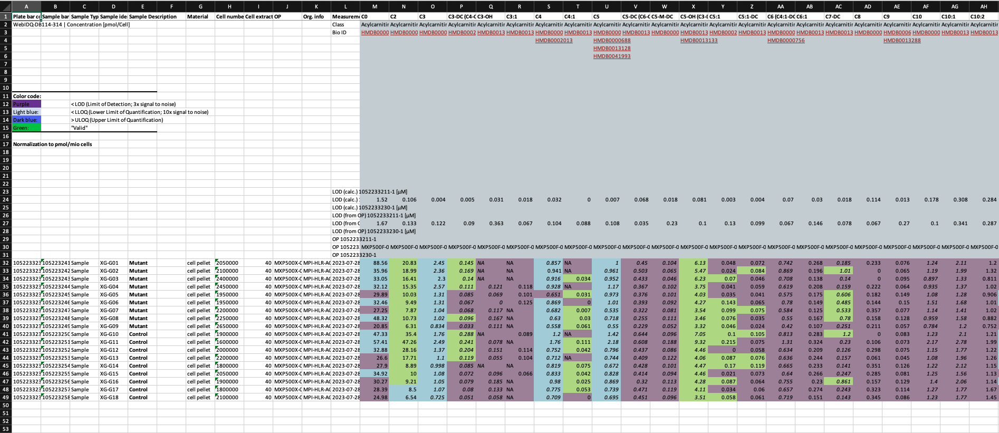

<style>
.vscroll-plot {
    width: 850px;
    height: 500px;
    overflow-y: scroll;
    overflow-x: hidden;
}
</style>


```{r setup, message=FALSE, warning=FALSE, echo=FALSE}
knitr::opts_chunk$set(echo=TRUE, cache=FALSE, collapse=TRUE, comment='#>', warning=FALSE, message=FALSE)

#If you haven't done this yet, install the MetAlyzer package
#devtools::install_github("Lu-Group-UKHD/MetAlyzer")
library(MetAlyzer)

#Load dependencies
library(dplyr)

```

::: {style="text-align: justify"}
The ***MetAlyzer*** R-package provides a robust toolkit for importing, handling, and analyzing metabolomics data generated 
using either the Biocrates Quant500L™ or Quant500XL™ kit and the Biocrates MetIDQ™ software (BIOCRATES Life Sciences AG, Innsbruck, Austria). It structures the data into a 
SummarizedExperiment (SE) [@Morgan2025SummarizedExperiment] object, facilitating integration with Bioconductor workflows and enabling downstream statistical 
analysis and visualization. To aid in biological interpretation, ***MetAlyzer*** offers functions to generate key visualizations. 
These include scatter plots with information about the metabolite classes as assigned by BIOCRATES Life Sciences AG and a network plot, which readily visualizes the whole 
metabolite space of the kit and colour codes the metabolites that are detected for e.g. Log2FC differences between conditions of interest. 
These network visualizations are crucial for understanding the complex interconnections between metabolites, 
helping to find pathway-level alterations and providing a systems perspective on the metabolic response under investigation.
:::

# Loading and Exploring Data
## Import data from MetIDQ™
::: {style="text-align: justify"}
***MetAlyzer's*** primary entry point is the `MetAlyzer::read_metidq()` function, which reads MetIDQ™ .xlsx output files (Fig. 1).\
As the output files contain layered information, inform of concentration values and color-coded quantification status (e.g., "Valid", "LOD", "LOQ"), 
it is a tedious task to reliably process this data computationally, as the mix of numerical values and status codes hinders direct machine readability by standard analysis tools.
To conveniently read the data in we provide the function `MetAlyzer::read_metidq()`, structuring the data into a SummarizedExperiment (SE) object [@Morgan2025SummarizedExperiment] for easy downstream analysis.
For further demonstration we'll use a demo dataset kindly provided by BIOCRATES Life Sciences AG, featuring metabolite measurements across two groups (MxP®Quant 500 kit). This dataset is included in the ***MetAlyzer*** R package as the example data.
:::

```{r echo=FALSE, fig.cap="Figure 1: Output of Biocrates MetIDQ™.", out.width="90%", fig.align="center"}

```


```{r initialise, message=FALSE, warning=FALSE}
# Access the example data file path
fpath <- MetAlyzer::load_demodata_biocrates()

# Load the data into a SummarizedExperiment object
metalyzer_se <- MetAlyzer::read_metidq(fpath,
                                       silent = TRUE)

# Display the object summary
metalyzer_se
```

::: {style="text-align: justify"}
The resulting SummarizedExperiment object organizes the data:

**Assay**: Contains matrices for `MetAlyzer::conc_values` (metabolite concentrations) and `MetAlyzer::quant_status` (quantification status). <br>
**rowData**: Stores metabolite information, including names and assigned classes. Note the distinction between quantified metabolites and calculated 'Metabolism Indicators'. <br>
**colData**: Holds sample-specific metadata provided in the input file or added later. <br>
**metadata**: Contains supplementary information like the original file path, sheet index, status color mappings, 
and a pre-joined aggregated_data tibble combining concentrations, status, and metadata for easier analysis and plotting.
:::
<div class="vscroll-plot">
```{r showcase, echo=FALSE, warning=FALSE, message=FALSE}
head(SummarizedExperiment::assay(metalyzer_se)) %>%
  kableExtra::kbl(caption = "Preview of Assay containing concentration values.") %>%
  kableExtra::kable_classic(full_width = F, html_font = "Cambria", font_size = 12)

head(SummarizedExperiment::rowData(metalyzer_se)) %>%
  kableExtra::kbl(caption = "Preview of Assay containing rowData.") %>%
  kableExtra::kable_classic(full_width = F, html_font = "Cambria", font_size = 12)

head(SummarizedExperiment::colData(metalyzer_se)) %>%
  kableExtra::kbl(caption = "Preview of Assay containing colData.") %>%
  kableExtra::kable_classic(full_width = F, html_font = "Cambria", font_size = 12)
```
</div>

## Differential analysis results

::: {style="text-align: justify"}
The ***MetAlyzer*** R package does not include processing or differential analysis itself, as it's aim is to import Biocrates files and visualize the results. Given the many tools and 
R packages dedicated for quality control and differential analysis, we decided to not focus on this within the R package. You can either use the MetAlyzer shiny app, the MetAlyzer helper functions used in the shiny app or other dedicated R-packages specifically designed to support those analysis such as the ***MetaProViz*** R package [@Schmidt2025]. If you are not familiar with using R, you can use our shiny app, which will do the whole process from start to finish [(Link to MetAlyzer Shiny App)](https://metalyzer.shinyapps.io/MetAlyzer_ShinyApp/).\
If you already have differential analysis results, you can skip this section and just load our internal example data of differential analysis results `MetAlyzer::toy_diffres()`. 
:::
```{r import, message=FALSE, warning=FALSE}
diffres_df <- readRDS(MetAlyzer::toy_diffres())

head(diffres_df) %>%
  kableExtra::kbl(caption = "Preview of Assay containing colData.") %>%
  kableExtra::kable_classic(full_width = F, html_font = "Cambria", font_size = 12)

#@Add: t-value column into the example data!
```
\
::: {style="text-align: justify"}
This table contains columns for metabolite names (`Metabolite`), their class (`Class`), calculated log2 fold change (log2FC), and adjusted p-values (adj.P.Val). 
We can directly use this dataframe as input to the to the ***MetAlyzer*** visualization functions.

:::

::: {style="text-align: justify"}
# MetAlyzer Plots
The plotting functions `MetAlyzer::plot_scatter()` and `MetAlyzer::plot_network()` can accept a standard data frame containing differential expression results.
This example data was generated from the raw extraction data, and compares the concentrations between the different tissue types. @ADD more biological informations!

## Scatter Plot

::: {style="text-align: justify"}
The `MetAlyzer::plot_scatter()` function visualizes log2 fold changes, primarily to assess the behavior of different **metabolite classes**. 
Background colors distinguish these classes, enabling users to interpret if certain groups of metabolites exhibit distinct regulatory patterns 
(e.g., consistent up/down-regulation, specific ranges of fold changes). The plot is horizontally separated by extraction method ("LC" left, "FIA" right), 
allowing comparison of whether these observed class-specific trends are consistent across both methods or show method-dependent variations.
:::

```{r scatter, message=FALSE, warning=FALSE, , fig.width=15, fig.height=7.5, fig.align="left"}
# Scatter plot grouped by metabolic class
MetAlyzer::plot_scatter(diffres_df)
```

## Pathway Network Visualization

::: {style="text-align: justify"}
Visualize significant changes across metabolic pathways using `MetAlyzer::plot_network()`. This function maps the log2 fold changes (log2FC) of metabolites onto a predefined network structure, representing known biochemical reactions and relationships.

### Relevance and Interpretation:

This network visualization provides a **systems-level perspective**, going beyond individual metabolite changes. Its relevance lies in helping users understand how metabolic perturbations are interconnected within the broader context of biological pathways. By examining the network, users can:
\
* **Identify affected pathways:** Observe clusters of connected nodes with significant changes (indicated by color) within labeled pathways (e.g., "TCA Cycle", "Fatty Acids", "Bile Acids" as seen in Figure X). This suggests potential up- or down-regulation of entire metabolic processes.\
* **Understand relationships:** Trace connections between metabolites to see how changes in one area might influence others upstream or downstream.\
* **Generate hypotheses:** Patterns observed in the network can suggest underlying mechanisms or key regulatory points affected by the experimental conditions.\
\
Importantly, for the colour coding of the metabolites the user can chosse different information like Log2FC, t-value or also p-value, dependent on the needs.

:::

```{r network, message=FALSE, warning=FALSE, out.width="100%"}
# Generate network plot from the data frame
# Requires metabolite, class, log2fc, and p-value columns
network <- MetAlyzer::plot_network(
  diffres_df,
  q_value = 0.05,
  metabolite_col = "Metabolite",
  values_col_name = "log2FC",
  stat_col_name = "qval",
  metabolite_text_size = 2,
  connection_width = 0.75,
  pathway_text_size = 4,
  pathway_width = 4,
)

network$Plot
```

::: {style="text-align: justify"}
### Node Summarization and Representation:

Each node in the network represents a metabolite or a metabolite class. The color of the node typically reflects its log2FC value (incase the viridis scale was selected, yellow represents a positiv log2 Fold Change and purlbe a negative log2 Fold Change).\
Some nodes, such as 'T14' which might group related species like 'T 14:0_32:2', 'T 14:0_34:0', 'T 14:0_34:1', display a **summarized value**. This value is calculated according to the following hierarchy to prioritize significant findings:\
\
1.  **Mean of Significant:** If one or more metabolites mapping to the node are statistically significant (e.g., based on FDR corrected p-values), the node's value represents the **mean log2FC of only those significant metabolites**.\
2.  **Mean of Measured:** If *none* of the associated metabolites are significant, but measurements exist for them, the node's value represents the **mean log2FC of *all* measured metabolites** mapping to that node.\
3.  **NA:** If no metabolites mapping to the node were measured or included in the dataset, the node value is NA (often represented as grey or uncolored, like some nodes in Figure X).\
\
This summarization approach provides a concise overview within the network, highlighting significant changes where present, while still providing context from measured data if significance is not reached.
Due to the changing naming convention of Biocrates, we include old names in the excel file, which will show up as NA for later generated MetIDQ™ outputs (e.g. TG(14:0_32.2)), but this enables the analysis of older files as well. @ADD we need a date here, like from which year the exports work, and guidance how someone can export the required old names form MetIDQ as we know how that works
:::

```{r networkTable, message=FALSE, warning=FALSE}
T14_node_expanded <- network$Table%>%
  dplyr::filter(Label == "T14")%>%
  tidyr::separate_rows(Metabolites, values, stat, sep = "\\s*;\\s*") %>%
  dplyr::rename(p.val = stat, Log2FC = values) %>%
  dplyr::mutate(
    Log2FC = as.numeric(Log2FC),
    p.val = as.numeric(p.val)
  )
```

<div class="vscroll-plot">
```{r, echo=FALSE, message=FALSE, warning=FALSE}
T14_node_expanded %>%
  kableExtra::kbl(caption = "T14 Node detailed Information") %>%
  kableExtra::kable_classic(full_width = F, html_font = "helvetica", font_size = 12)
```
</div>

:::
For easy visualisation of the summarized nodes, you can plot them as a Volcano plot or Lollipop graph.  this allows to inspect the direction of change (negative/positive Log2FC) and p-value of the differential analysis. Here we show a minimal example using ggplot2 (@ADD Reference).
:::

```{r message=FALSE, warning=FALSE, fig.width=6, fig.height=4.5, fig.align="left"}
ggplot2::ggplot(T14_node_expanded %>%na.omit(), ggplot2::aes(x=Log2FC, y=Metabolites)) +
  ggplot2::geom_segment(ggplot2::aes(x=0, xend=Log2FC, yend=factor(Metabolites)))+
  ggplot2::geom_point(ggplot2::aes(size =p.val)) +
  ggplot2::scale_size_continuous(trans = "reverse", range = c(6, 12))+
  ggplot2::labs(title = "Lollipop Plot T14:0 Node")
```
                        
# Session information

```{r session_info, echo=FALSE}
options(width = 120)
sessionInfo()
```

# Bibliography
